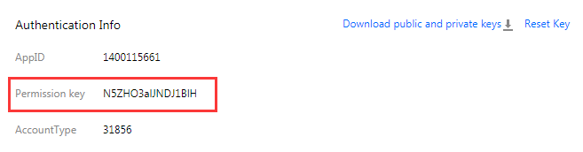

### 1. Overview
Game Multimedia Engine (GME) provides audio/video keys for authentication for joining voice chat room and encryption of permissions for sending upstream and downstream data.
- Key: APPID corresponds to the MD5 value of audio/video key, with a length of 16 bytes.
- Encryption algorithm: TEA

Obtain the key in the following location at Tencent Cloud backend. 

The modified key takes effect within 15 minutes to 1 hour. Frequent modification is not recommended.

### 2. Encryption of Permission for Joining Room
#### 2.1. Ciphertext content
<table class="t">
<tbody><tr>
<th> Field Description
</th><th> Type/Length
</th><th> Description
</th></tr>
<tr>
<td> cVer
</td><td> unsigned char/1
</td><td> Version No. Set  to 0.
</td></tr>
<tr>
<td> wAccountLen
</td><td> unsigned short/2
</td><td> Length of third-party account
</td></tr>
<tr>
<td> buffAccount
</td><td> wAccountLen
</td><td> Characters of third-party account
</td></td>
<tr>
<td> dwSdkAppid
</td><td> unsigned int/4
</td><td> sdkappid
</td></tr>
<tr>
<td> dwAuthId
</td><td> unsigned int/4
</td><td> Group ID (roomID)
</td></tr>
<tr>
<td> dwExpTime
</td><td> unsigned int/4
</td><td> Expiration time  
(current time + validity period) (in sec). 300 seconds is recommended.
</td></tr>
<tr>
<td> dwPrivilegeMap
</td><td> unsigned int/4
</td><td> Permission bit.  Set it to: AUTH_BITS_DEFAULT
</td></tr>
<tr>
<td> dwReserved
</td><td> unsigned int/4
</td><td> Set to 0
</td></tr></tbody></table>

#### 2.2. Encryption method	
1. Convert numbers in ciphertext to network byte order (big endian);
2. Construct the ciphertext into a string;
3. Encrypt the string with TEA algorithm. The string output by function symmetry_encrypt is the encrypted permission string (Note: Do not convert the binary strings into hexadecimal ones)

#### 2.3. Tips on usage
The encrypted string generated at backend is delivered to the client and used for the following two scenarios:
1. When API enterRoom is called for joining a room, the encrypted string is transferred to the field authBuffer in the parameters for joining room.
2. When API ChangeRole is called to modify a role, the encrypted string is transferred to the parameter authBuffer or buff.
