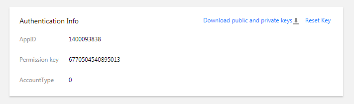

## 개요

텐센트의 클라우드 게임 멀티미디어 엔진 SDK를 사용해 주셔서 감사합니다. 개발자들의 디버그 및 텐센트의 클라우드 게임 멀티미디어 엔진 제품의 접속에 편의를 제공하기 위해 모든 플랫폼에 적용되는 KEY 관련 기술 문서를 소개해 드립니다.

[GME密钥文档](https://github.com/TencentMediaLab/GME/blob/master/GME%20Developer%20Manual/GME%20Key%20Manual.md)

## 실시간 음성 KEY
텐센트의 클라우드 게임 멀티미디어 엔진은 A-KEY를 제공하여 관련 기능의 암호화 및 인증(authentication)에 사용합니다. 인증에 사용되는 서명 생성 과정은 평문, KEY 및 프로토콜과 관련이 있습니다. 

평문은 아래 필드의 빅 엔드언 조합입니다.

|필드 서술    		| 유형/길이	| 값 정의/비고|
| ---------------- |-------------------|--------------|
| cVer				|unsigned char/1	|버전번호, 입력 수치: 0|
| wAccountLen		|unsigned short/2	|제3자 자체 계정 길이|
| buffAccount		|wAccountLen		|제3자 자체 계정 문자열|
| dwSdkAppid		|unsigned short/4	|제3자 자체의 appid|
| dwAuthid			|unsigned int/4		|그룹 번호				|
| dwExpTime		|unsigned int/4		|기한초과 시간(현재 시간+유효기간 [단위: 초, 300초 추천]）|
| dwPriviegeMap	|unsigned int/4		|ITMG_AUTH_BITS_DEFAULT는 모든 권한 표시|
| dwReserved		|unsigned int/4		|입력 수치: 0|

### 1.KEY
텐센트 GME 콘솔은 관련 권한 KEY를 입수합니다.

### 2.프로토콜
TEA 대칭 암호화 프로토콜.
전반적 제안, 초기 사용 클라이언트 접속 배치(deploy) 방안을 제안하며 향후 게임 App 백그라운드 배치로 최적화할 수 있습니다.  

|방안       		| 장점        		| 단점																																|
| ------------- |-------------|-------------| 
| 백그라운드 배치    		|안전성 높음	|백그라운드 개발 공동 디버크 필요|
| 클라이언트 배치      	|접속 빠름	|안전성 낮음|

#### 백그라운드 배치 사용 방법
백그라운드에서 암호화 스트링이 생성된 다음 클라이언트로 발송하며, 클라이언트는 아래 신에 사용될 수 있습니다. API enterRoom을 호출하여 입실 조작 시 암호화 스트링을 입실 파라미터의 authBuffer 필드로 전송합니다.

### 3.프로토콜 암호화 내역
- Key: APPID 관련 인증키의 md5치, 길이는 16 바이트
- 암호화 프로토콜: TEA 암호화
- 암호화 라이브러리 및 예시: 별첨 [authbuffer.zip](https://main.qcloudimg.com/raw/eac8e36ca4a24edf9414dfe7f58a764a.zip)

**주의**
콘솔에서 KEY를 변경한 다음 15분 ~ 1시간 내에 효력을 발생하며 빈번한 변경을 추천하지 않습니다.

#### 암호화 방법	
- 암호문의 숫자를 빅 엔드언으로 전환됩니다.
- 암호문을 한 단락의 문자열로 조합합니다.
- tea암호화로 문자열을 암호화하며, symmetry_encrypt함수가 출력한 문자열이 즉 권한 암호화 스트링입니다.

**주의**
이진법 문자열을 16진법으로 바꾸지 마십시오.

