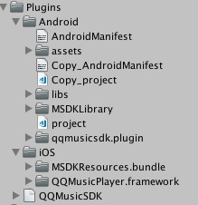

## 简介

欢迎使用腾讯云游戏多媒体引擎 SDK 。为方便 Unity 开发者调试和接入腾讯云游戏多媒体引擎产品 QQMusic API，这里向您介绍适用于 Unity 开发的 QQ 音乐相关 API 接入技术文档。

## QQ 音乐接入指引
### 1.在各平台进行相关的注册。
[QQ 开发者平台](http://open.qq.com/)
[微信开发者平台](https://open.weixin.qq.com/)
[QQ 音乐开发者平台](http://y.qq.com/cp/homepage.html#/home)


### 2.将相关 SDK 文件导入工程中，文件夹视图如下图所示。
路径： 工程目录\Assets\Plugins




## QQ 音乐相关 API 初始化
### 1.设置相关信息
设置相关信息，用于调用相关 API 的初始化。其中参数的获取参考接入文档。
> 函数原型

```
QQMusicEngine void SetAppInfo (String app_id,String app_key,String app_private_key)
```
|参数     | 类型         |意义|
| ------------- |:-------------:|-------------
| app_id    			|string	|QQ 音乐分配的 appid|
| app_key    			|string	|QQ 音乐分配的 appkey|
| app_private_key	|string	|QQ 音乐分配的 app_private_key|
> 示例代码
  
```
QQMusicEngine.GetInstance().SetAppInfo(app_id,app_key,app_private_key);
```

### 2.QQ 账号登录
调用此接口，用 QQ 账号登录。相关参数需要在 QQ 开放平台上获取。
> 函数原型

```
QQMusicEngine void LoginWithQQ (String open_app_id,String open_id,String access_token)
```

|参数     | 类型         |意义|
| ------------- |:-------------:|-------------
| open_app_id	|string	|QQ 开放平台上的 app_id|
| open_id		|string	|QQ 登录后返回的 open_id|
| access_token	|string	|QQ 登录后返回的 access_token|
> 示例代码
  
```
QQMusicEngine.GetInstance().LoginWithQQ(open_app_id,open_id,access_token);
```

### 3.微信账号登录
调用此接口，用微信账号登录。相关参数需要在微信开放平台上及 QQ 音乐平台获取。
> 函数原型

```
QQMusicEngine void LoginWithWx (String open_app_id, String open_id, String access_token,String bind_music_third_appname, Action<QMWxLoginResult> callback)
```

|参数     | 类型         |意义|
| ------------- |:-------------:|-------------
| open_app_id	|string	|微信开放平台上的 app_id|
| open_id		|string	|微信登录后返回的 open_id|
| access_token	|string	|微信登录后返回的 access_token|
| bind_music_third_appname|string|QQ 音乐发放的 bind_music_third_appname|
> 示例代码
  
```
QQMusicEngine.GetInstance().LoginWithWx(open_app_id,open_id,access_token,bind_music_third_appname);
```

## 歌曲及歌单操作
### 1.设置本地歌曲信息
设置本地歌曲信息，需要获取本地歌曲的配置信息文件。该文件为 JSON 格式，由开发者自行建立，示例模板于示例工程中可以获取，路径为 Demo\Assets\StreamingAssets\songs_info.json。
> 函数原型

```
QQMusicEngine void SetLocalSongListInfo (string localSongInfo, string localSongsDir)
```

|参数     | 类型         |意义|
| ------------- |:-------------:|-------------
| localSongInfo	|string	|本地歌曲信息|
| localSongsDir	|string	|本地歌曲路径（不加文件名）|
> 示例代码
  
```
QQMusicEngine.GetInstance().SetLocalSongListInfo(localSongInfo,localSongsDir);
```

### 2.获取本地歌曲列表
获取本地歌曲列表。
> 函数原型

```
QQMusicEngine void GetLocalMusicList (Action<QMSongInfoResult> callback)
```

|参数     | 类型         |意义|
| ------------- |:-------------:|-------------
| callback|QMSongInfoResult|回调函数|

> 示例代码
  
```
QQMusicEngine.GetInstance().GetLocalMusicList(QMSongInfoResult_callback);
```

### 3.获取 QQ 音乐歌曲信息
获取 QQ 音乐歌曲信息。
> 函数原型

```
QQMusicEngine void GetSongInfoBatch (string song_mid, Action<QMSongInfoResult> callback)
```

|参数     | 类型         |意义|
| ------------- |:-------------:|-------------
| song_mid|string|表示歌曲 mid，多个 mid 用逗号分割|
| callback|QMSongInfoResult|回调函数|

> 示例代码
  
```
QQMusicEngine.GetInstance().GetSongInfoBatch(song_mid,QMSongInfoResult_callback);
```

### 4.获取 QQ 音乐歌曲歌词
获取 QQ 音乐歌曲歌词。
> 函数原型

```
QQMusicEngine void GetLyric (int song_id, Action<QMLyricResult> callback)
```

|参数     | 类型         |意义|
| ------------- |:-------------:|-------------
| song_id|string|表示歌曲 id|
| callback|QMSongInfoResult|回调函数|

> 示例代码
  
```
QQMusicEngine.GetInstance().GetSongInfoBatch(song_mid,QMSongInfoResult_callback);
```

### 5.获取 QQ 音乐歌单目录
获取 QQ 音乐歌单目录。
> 函数原型

```
QQMusicEngine void GetSonglistSelf(Action<QMDissListResult> callback)
```

|参数     | 类型         |意义|
| ------------- |:-------------:|-------------
| callback|QMDissListResult|回调函数|

> 示例代码
  
```
QQMusicEngine.GetInstance().GetSonglistSelf(QMDissListResult_callback);
```

### 6.获取 QQ 音乐歌单中歌曲列表
获取 QQ 音乐歌单中歌曲列表。
> 函数原型

```
QQMusicEngine void GetSonglistDetail(long dissid,int page,int page_size,Action<QMSongListItemResult> callback)
```

|参数     | 类型         |意义|
| ------------- |:-------------:|-------------
| dissid|long|要操作的歌单 id|
| page|int|请求歌曲列表的页数，如第一页，第二页|
| page_size|int|每页的歌曲数|
| callback|QMSongListItemResult|回调函数|

> 示例代码
  
```
QQMusicEngine.GetInstance().GetSonglistDetail(dissid,page,page_size,QMSongListItemResult_callback);
```

### 7.QQ 音乐个人收藏中增加/删除歌曲
在个人收藏中增加/删除歌曲。
> 函数原型

```
QQMusicEngine void OperFavSong(string uin,int cmd,string song_ids,Action<QMResult> callback)
```

|参数     | 类型         |意义|
| ------------- |:-------------:|-------------
| uin			|string		|登录账号|
| cmd			|int			|操作类型，1：增加，2删除|
| song_ids	|string		|歌曲列表，逗号分隔|
| callback	|QMResult	|回调函数|

> 示例代码
  
```
QQMusicEngine.GetInstance().OperFavSong(uni,cmd,song_ids,QMResult_callback);
```

### 8.QQ 音乐歌单中增加/删除歌曲
在歌单中增加/删除歌曲。
> 函数原型

```
QQMusicEngine void OperSongOfSonglist(string uin,int cmd,long dissid,string song_ids,Action<QMResult> callback)
```

|参数     | 类型         |意义|
| ------------- |:-------------:|-------------
| uin			|string		|登录账号|
| cmd			|int			|操作类型，1：增加，2删除|
| dissid		|long			|要操作的歌单id|
| song_ids	|string		|歌曲列表，逗号分隔|
| callback	|QMResult	|回调函数|

> 示例代码
  
```
QQMusicEngine.GetInstance().OperFavSong(uni,cmd,dissid,song_ids,QMResult_callback);
```

### 9.获取 QQ 音乐排行榜榜单
获取 QQ 音乐排行榜榜单。
> 函数原型

```
QQMusicEngine void GetToplist(Action<QMTopListResult> callback)
```

|参数     | 类型         |意义|
| ------------- |:-------------:|-------------
| callback	|QMTopListResult	|回调函数|

> 示例代码
  
```
QQMusicEngine.GetInstance().GetToplist(QMTopListResult_callback);
```

### 10.获取 QQ 音乐排行榜榜单详情
获取 QQ 音乐排行榜榜单详情。
> 函数原型

```
QQMusicEngine void GetToplistInfo(int top_id,int page,int page_size,Action<QMTopListInfoResult> callback)
```

|参数     | 类型         |意义|
| ------------- |:-------------:|-------------
| top_id		|int	|排行榜榜单id|
| page		|int	|请求的页数，如请求第一页|
| page_size	|int	|每页的歌曲数|
| callback	|QMTopListInfoResult|回调函数|


> 示例代码
  
```
QQMusicEngine.GetInstance().GetToplistInfo(top_id,page,page_size,QMTopListInfoResult_callback);
```


## 播放器
### 1.设置播放的歌曲
此接口用于设置播放的歌曲。
> 函数原型

```
QQMusicPlayer void Reset (string url)
```

|参数     | 类型         |意义|
| ------------- |:-------------:|-------------
| url		|string	|歌曲地址，本地歌曲为本地路径，QQ 音乐歌曲为 QQ 音乐返回的 url|
> 示例代码
  
```
QQMusicPlayer().GetPlayer().Reset(url);
```

### 2.播放歌曲
此接口用于播放歌曲。
> 函数原型

```
QQMusicPlayer void Play ()
```

> 示例代码
  
```
QQMusicPlayer().GetPlayer().Play();
```

### 3.停止播放歌曲
此接口用于停止播放歌曲。
> 函数原型

```
QQMusicPlayer void Pause ()
```

> 示例代码
  
```
QQMusicPlayer().GetPlayer().Pause();
```

### 4.判断是否在播放音乐
此接口用于断是否在播放音乐。
> 函数原型

```
QQMusicPlayer bool IsPlaying ()
```

> 示例代码
  
```
bool mIsPlay = QQMusicPlayer().GetPlayer().IsPlaying();
```

### 5.暂停播放器
需要暂停播放器时，调用此接口。
> 函数原型

```
QQMusicPlayer void PauseEngine ()
```

> 示例代码
  
```
QQMusicPlayer().GetPlayer().PauseEngine();
```

### 6.恢复播放器
需要回复播放器时，调用此接口。
> 函数原型

```
QQMusicPlayer void ResumeEngine ()
```

> 示例代码
  
```
QQMusicPlayer().GetPlayer().ResumeEngine();
```

### 7.设置音量
此函数用于设置音量，值域为0到1，默认为1。
> 函数原型

```
QQMusicPlayer void SetVolume (float volume)
```

|参数     | 类型         |意义|
| ------------- |:-------------:|-------------
| volume		|float	|音量数值|
> 示例代码
  
```
QQMusicPlayer().GetPlayer().SetVolume(volume);
```

### 8.获取音量
此函数用于获取音量。
> 函数原型

```
QQMusicPlayer float GetVolume ()
```

> 示例代码
  
```
QQMusicPlayer().GetPlayer().GetVolume();
```

### 9.获取音乐时长
此函数用于获取音乐时长。
> 函数原型

```
QQMusicPlayer int GetDuration ()
```

> 示例代码
  
```
QQMusicPlayer().GetPlayer().GetDuration();
```

### 10、获取音乐播放进度
此函数用于音乐播放进度。
> 函数原型

```
QQMusicPlayer int GetCurrentTime ()
```

> 示例代码
  
```
QQMusicPlayer().GetPlayer().GetCurrentTime();
```

### 11.设置音乐播放进度
此函数用于设置音乐播放进度。
> 函数原型

```
QQMusicPlayer void SetCurrentTime (int timeMs)
```

|参数     | 类型         |意义|
| ------------- |:-------------:|-------------
| timeMs		|int	|音乐进度（毫秒）|
> 示例代码
  
```
QQMusicPlayer().GetPlayer().SetCurrentTime(timeMs);
```

### 12.播放器更新事件函数
此接口用于更新播放器事件，在 Unity MonoBehaviour Update 中调用。
> 函数原型

```
QQMusicPlayer void Poll ()
```

> 示例代码
  
```
QQMusicPlayer().GetPlayer().Poll();
```

### 13.歌曲播放完毕事件
此函数为一个歌曲播放完毕监听事件，业务层可以进行监听。
> 函数原型

```
public delegate void OnPlayEndHandler (string url, int result, string msg);

public event OnPlayEndHandler OnPlayEnd;
```

|参数     | 类型         |意义|
| ------------- |:-------------:|-------------
| url		|string	|歌曲地址，本地歌曲为本地路径，QQ 音乐歌曲为 QQ 音乐返回的 url|
| result		|int	|是否播放完毕|
| msg			|int	|相关信息|
> 示例代码
  
```
QQMusicPlayer.GetPlayer ().OnPlayEnd += new QQMusicPlayer.OnPlayEndHandler (OnPlayEnd);
```


## 播放器扩展功能
示例代码提供相关功能实现，业务层仅作参考。
### 1.播放下一首\上一首
该函数会传入两个参数，例如单曲循环下，如果 byUser 为 True，即是由用户自己按下去的，便会播放下一首歌曲，如果 byUser 为 False，即系统调用，单曲循环下还是播放当前这首歌曲。

> 示例代码
  
```
//播放模式
public enum ListPlayType
    {
        LOOP,
        SHUFFLE,
        SINGLE,
    }
    
//播放下一首
public void SelectNext(bool byUser, bool autoPlay) {
        GenerateNextSongIndex (true, byUser);
        if (autoPlay) {
            this.Play ();
        }
    }

//播放上一首
public void SelectPrevious(bool byUser, bool autoPlay) {
        GenerateNextSongIndex (false, byUser);
        if (autoPlay) {
            this.Play ();
        }
    }

private void GenerateNextSongIndex(bool next, bool byUser) {
        int currentSongIndex = mCurrentSongIndex;
        if (mListPlayType == ListPlayType.LOOP || (mListPlayType == ListPlayType.SINGLE && byUser == true)) {
            if (next) {
                currentSongIndex++;
                if (currentSongIndex > mSongs.Count)
                    currentSongIndex = 0;
            } else {
                currentSongIndex--;
                if (currentSongIndex < 0)
                    currentSongIndex = mSongs.Count - 1;
            }
        } else if (mListPlayType == ListPlayType.SHUFFLE) {
            if (mSongs.Count > 1) {
                int oldCurrentSongIndex = currentSongIndex;
                do {
                    currentSongIndex = UnityEngine.Random.Range (0, mSongs.Count);
                } while (currentSongIndex == oldCurrentSongIndex);
            }
        } else if (mListPlayType == ListPlayType.SINGLE) {

        }

        Debug.LogFormat ("{0} -> {1}, in {2} playType: {3}", mCurrentSongIndex, currentSongIndex, mSongs.Count, mListPlayType);
        this.ResetSongList (mSongs, currentSongIndex);
    }

```


### 2.重置歌曲列表
该示例函数用于重置歌曲列表。
> 示例代码
  
```
private List<QMSongInfo> mSongs = new List<QMSongInfo>();
private int mCurrentSongIndex = -1;


public void ResetSongList(List<QMSongInfo> songs, int songIndex) {
        mSongs = songs;
        mCurrentSongIndex = songIndex;
        if (mSongs.Count <= 0) {
            QQMusicPlayer.GetPlayer ().Reset ("");
        } else {
            if (mCurrentSongIndex < 0 || mCurrentSongIndex >= mSongs.Count)
                mCurrentSongIndex = 0;
            string url = mSongs [mCurrentSongIndex].GetSongPlayUrl (QMSongQuality.QMSongQuality_None);
            QQMusicPlayer.GetPlayer ().Reset (url);
        }
        if (this.OnPlayingIndexChange != null) {
            this.OnPlayingIndexChange (mCurrentSongIndex);
        }
    }

```


