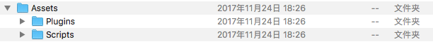
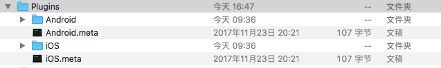
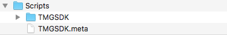
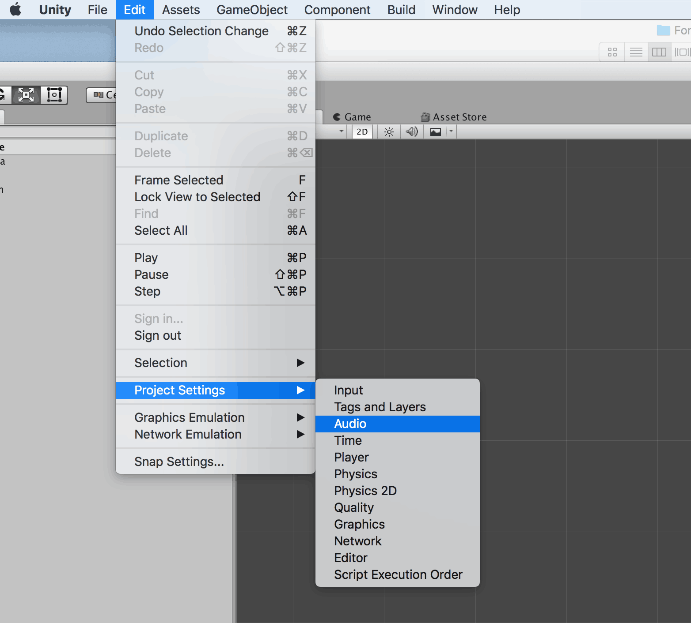
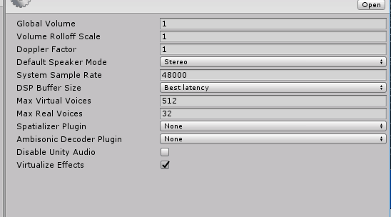

## 简介
欢迎使用腾讯云游戏多媒体引擎 SDK 。为方便 Unity 开发者调试和接入腾讯云游戏多媒体引擎产品 API，这里向您介绍适用于 Unity 开发的工程配置。

## SDK 准备
可以通过以下流程获取 SDK。

### 1. 请在[下载指引](https://cloud.tencent.com/document/product/607/18521)下载相关 Demo 及 SDK。

### 2. 在界面中找到 Unity 版本的 SDK 资源。

### 3. 点击【下载】按钮。
下载完的SDK资源解压后有以下几个部分：

|文件名       | 说明           
| ------------- |:-------------:|
| Plugins   	|SDK 库文件|
| Scripts     	|SDK 代码文件|

## 预备工作

### 1. 导入 Plugins 文件  
将开发工具包中 Plugins 文件夹中的文件复制在 Unity 工程中 Assets 下的 Plugins 文件夹中，如图所示：  

### 2. 导入代码文件  
将开发工具包中 Scripts 文件夹中的文件复制在 Unity 工程中存放代码的文件夹中，如图所示：  

### 3. 音频设置
在 Unity 编辑器中，Edit-Project Setting-Audio 请使用系统默认即可，如果进行修改，Unity 播放音效会因为在iOS上设置硬件缓存区受影响，表现为音效被打断。

如果设置为下图这种模式，Unity 播放音效会因为在iOS上设置硬件缓存区受影响，表现为音效被打断。

