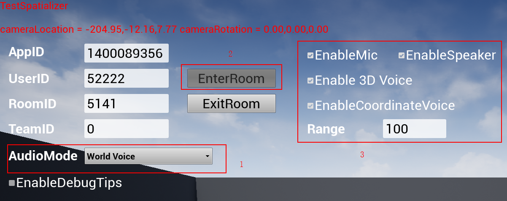
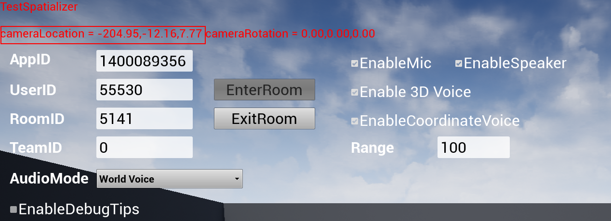
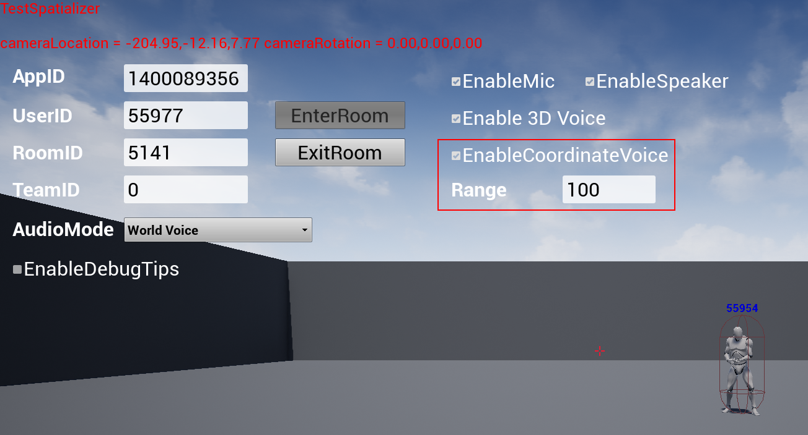

## 1.Guide To Gloable 3D Voice (Same as World Mode in PUBG)

### 1-1.EnterRoom
Click the EnterRoom button, the software will enter the room specified by RoomID, with UserID as the user's unique identification.
Upon successfully entering the Room,  

- 1.The EnterRoom button will turn gray, 
- 2.Mic & Speaker will be turned on automatically, and 3D voice and range voice will be activated simultaneously.

### 1-2.Testing the 3D Voice effect 
It requires at least two users to be in the same room. 

Use the W-A-S-D buttons on the keyboard to move around, and the real-time user coordinates will be shown at the top left corner of the screen, labelled by “cameraLocation”.

> Remark : Only simple functions are implemented in the demo. The real-time user coordicates are private, and not shared with any other users.

### 1-3.The Range Voice
The range voice will be enabled automatically, indicated by the checked EnableCoordinateVoice checkbox.
Range is set to 100 by default, indicating that the maximum distance for 2 users to hear each other is 100.
The default Range value 100 is in engine unit, which can be customized to other positive integers to meet various demands. For more details, please refer to the development document.
> Remark : this mode can only be implemented in the global voice and can be controlled by the developer.

## 2.Guide To Team Voice(Same as Team Mode in PUBG)
### 2-1.Use Team Voice
Before entering the room, 
- 1.Set the TeamID to a non-zero, positive integer,
- 2.Switch AudioMode to Team Voice,
and finally
- 3.click the EnterRoom button to enter the room, as mentioned earlier in Section 1-1.
Under this mode, team members are able to chat with each other.
> Remark : Since team members will always have to hear from each other, the range voice mentioned in Section 1-3 is not applicable here.