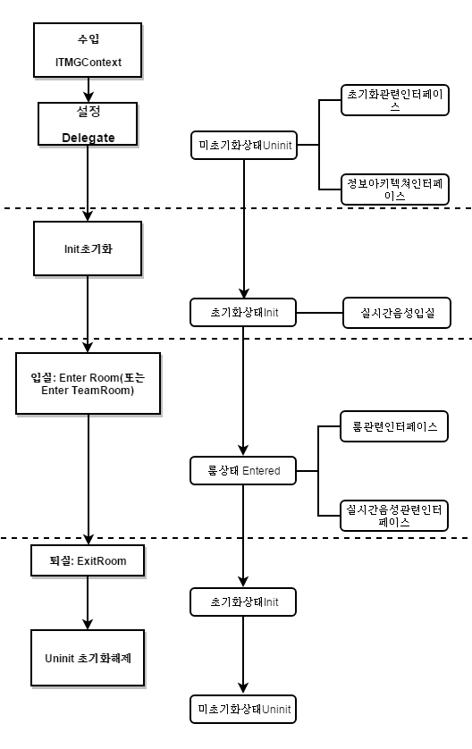

## 개요
텐센트의 클라우드 게임 멀티미디어 엔진 SDK를 사용해 주셔서 감사합니다. Unreal Engine 개발자들의 디버그 및 텐센트의 클라우드 게임 멀티미디어 엔진 제품인 API의 접속에 편의를 제공하기 위해 Unreal Engine 개발에 적용되는 접속 기술 문서를 소개해 드립니다.

[Unreal Engine 开发接入技术文档](https://github.com/TencentMediaLab/GME/blob/master/GME%20Developer%20Manual/Unreal%20Engine%20Developer%20Manual/Unreal%20Engine%20SDK%20Developer%20Manual.md)

[Unreal Engine SDK Developer Manual](https://github.com/TencentMediaLab/GME/blob/master/GME%20Developer%20Manual/Unreal%20Engine%20Developer%20Manual/Unreal%20Engine%20SDK%20Developer%20Manual_intl.md)

## 목차
[초기화 관련 인터페이스](https://github.com/TencentMediaLab/GME/blob/master/GME%20Developer%20Manual/Unreal%20Engine%20Developer%20Manual/Unreal%20Engine%20SDK%20Developer%20Manual.md#%E5%88%9D%E5%A7%8B%E5%8C%96%E7%9B%B8%E5%85%B3%E6%8E%A5%E5%8F%A3)

[실시간 음성 룸 이벤트 인터페이스](https://github.com/TencentMediaLab/GME/blob/master/GME%20Developer%20Manual/Unreal%20Engine%20Developer%20Manual/Unreal%20Engine%20SDK%20Developer%20Manual.md#%E5%AE%9E%E6%97%B6%E8%AF%AD%E9%9F%B3%E6%88%BF%E9%97%B4%E7%9B%B8%E5%85%B3%E6%8E%A5%E5%8F%A3)

[실시간 음성 오디오 인터페이스](https://github.com/TencentMediaLab/GME/blob/master/GME%20Developer%20Manual/Unreal%20Engine%20Developer%20Manual/Unreal%20Engine%20SDK%20Developer%20Manual.md#%E5%AE%9E%E6%97%B6%E8%AF%AD%E9%9F%B3%E9%9F%B3%E9%A2%91%E6%8E%A5%E5%8F%A3)

[고급 인터페이스](https://github.com/TencentMediaLab/GME/blob/master/GME%20Developer%20Manual/Unreal%20Engine%20Developer%20Manual/Unreal%20Engine%20SDK%20Developer%20Manual.md#%E9%AB%98%E7%BA%A7-api)

[콜백 메시지 리스트](https://github.com/TencentMediaLab/GME/blob/master/GME%20Developer%20Manual/Unreal%20Engine%20Developer%20Manual/Unreal%20Engine%20SDK%20Developer%20Manual.md#%E5%9B%9E%E8%B0%83%E6%B6%88%E6%81%AF)

## 사용 계통도



### GME 사용 시 중요 사항

|중요한 인터페이스     | 인터페이스 의미|
| ------------- |:-------------:|
|Init		    		|초기화 GME 	|
|Poll    			|트리거 이벤트 콜백	|
|EnterRoom	 		|입실  		|
|EnableMic	 		|마이크 ON 	|
|EnableSpeaker			|스피커 ON 	|

**설명**

**GME의 인터페이스 호출 완료 후의 반환값은 QAVError.OK로 수치는 0임.**

**동일 스레드 하에서 GME의 인터페이스를 호출해야 한다.**

**GME의 입실은 인증(authentication)이 필요하며 문서의 인증 부분 내용 참조. **

**이 문서 대응 GME sdk version：2.0.2.38430.**
## 초기화 관련 인터페이스
미초기화 전 SDK는 미초기화 단계로 초기화 인증 후 SDK 초기화를 통해서만 입실이 가능합니다. 


|인터페이스     | 인터페이스 의미   |
| ------------- |:-------------:|
|Init    	|초기화 GME	| 
|Poll    	|트리거 이벤트 콜백 	|
|Pause   	|시스템 일시 정지	|
|Resume 	|시스템 복구	|
|Uninit    	|GME 초기화 해제|


### 준비 작업
GME에 접속하려면 우선 tmg_sdk.h 파일이 필요합니다. 헤더 파일 유형은 ITMGDelegate 를 승계하여 메시지의 전달 및 콜백을 진행합니다. 
> 예시 코드  
```
#include "tmg_sdk.h"

class UEDEMO1_API AUEDemoLevelScriptActor : public ALevelScriptActor, public ITMGDelegate
{
public:
...
private:
...
｝
```


### 설정 단일 예
EnterRoom 함수를 호출하기 전에 우선 ITMGContext를 취득해야 하고, 모든 호출은 ITMGContext에서 시작하고 ITMGDelegate로 콜백하여 앱으로 피드백하며 반드시 사전에 설정해야 합니다.
> 예시 코드  
```
ITMGContext* context = ITMGContextGetInstance();
context->SetTMGDelegate(this);
```
### 메시지 전달
인터페이스 유형은 Delegate 방법을 적용하여 애플리케이션으로 콜백 알림을 발송하는데 사용되며, 메시지 유형은 ITMG_MAIN_EVENT_TYPE 참조할 수 있으며, data는 Windows 플랫폼에서 json 문자열 포맷으로 표시되며 세부 key-value는 설명 파일 참조.

> 예시 코드 
```
//함수 구현:
//UEDemoLevelScriptActor.h:
class UEDEMO1_API AUEDemoLevelScriptActor : public ALevelScriptActor, public SetTMGDelegate
{
public:
	void OnEvent(ITMG_MAIN_EVENT_TYPE eventType, const char* data);
｝

//UEDemoLevelScriptActor.cpp:
void AUEDemoLevelScriptActor::OnEvent(ITMG_MAIN_EVENT_TYPE eventType, const char* data){
	//여기서 eventType에 대한 판단 및 조작을 진행한다.
}
```

### 초기화 SDK

해당 인터페이스는 텐센트 클라우드 콘솔에서 수입한 SdkAppId 번호를 파라미터로 하고 openId를 추가해야 하며, 상기 openId는 1개 유일한 사용자만 표시하고 규칙은  App 개발자가 스스로 제정하며 App 내부에서 중복되지 않으면 되니다(현재 INT64만 지원).
SDK 초기화 후에야 입실이 가능합니다.

> 함수 원형 

```
ITMGContext virtual void Init(const char* sdkAppId, const char* openId)
```
|파라미터     | 유형         |의미|
| ------------- |:-------------:|-------------|
| sdkAppId    	|char*   	|텐센트 클라우드 콘솔에서 수입한 SdkAppId 번호					|
| openID    	|char*   	|OpenID는 Int64 유형만 지원(string 인커밍으로 전환)하고 반드시 10000 이상으로 하며，사용자 식별에 사용.|

> 예시 코드

```
std::string appid = TCHAR_TO_UTF8(CurrentWidget->editAppID->GetText().ToString().operator*());
std::string userId = TCHAR_TO_UTF8(CurrentWidget->editUserID->GetText().ToString().operator*());
ITMGContextGetInstance()->Init(appid.c_str(), userId.c_str());
```


### 트리거 이벤트 콜백
Tick 내부 사이클의 Poll 호출을 통해 트리거 이벤트 콜백을 구현할 수 있습니다.

> 함수 원형

```
class ITMGContext {
protected:
    virtual ~ITMGContext() {}
    
public:    	
	virtual void Poll()= 0;
}

```
> 예시 코드
```
//헤더 파일 중의 성명
virtual void Tick(float DeltaSeconds);

//코드 구현
void AUEDemoLevelScriptActor::Tick(float DeltaSeconds) 
{   
ITMGContextGetInstance()->Poll();
}
```


### 시스템 일시정지

시스템에 Pause 이벤트가 발생하는 동시에 Pause를 하도록 엔진에 알려야 합니다.
> 함수 원형

```
ITMGContext int Pause()
```

### 시스템 복구
시스템에 Resume 이벤트가 발생하는 동시에 Resume을 하도록 엔진에 알려야 합니다.
> 함수 원형

```
ITMGContext  int Resume()
```


### SDK 초기화 해제
SDK에 대한 초기화 해제를 실시하여 미초기화 상태로 진입합니다.

> 함수 원형 
```
ITMGContext int Uninit()

```
> 예시 코드  
```
ITMGContext* context = ITMGContextGetInstance();
context->Uninit();
```


## 실시간 보이스룸 (Voice room) 관련 인터페이스
초기화 후 SDK 입실을 호출하여 입실 완료 후에야 실시간 음성 통화를 할 수 있습니다.

|인터페이스     | 인터페이스 의미 |
| ------------- |:-------------:|
|GenAuthBuffer    	|초기화 인증|
|EnterRoom   		|입실|
|IsRoomEntered   	|입실 완료 여부|
|ExitRoom 		|퇴실|
|ChangeRoomType 	|사용자 룸 오디오 유형 변경|
|GetRoomType 		|사용자 룸 오디오 유형 수입|


### 실시간 오디오 인증 정보
AuthBuffer 를 생성하여 관련 기능의 암호화 및 인증에 사용하며, 관련 파라미터의 취득 및 세부 내역은[GME KEY파일](https://github.com/TencentMediaLab/GME/blob/master/GME%20Developer%20Manual/GME%20Key%20Manual.md)참조。  

> 함수 원형
```
QAVSDK_API int QAVSDK_CALL QAVSDK_AuthBuffer_GenAuthBuffer(unsigned int appId, unsigned int authId, const char* strOpenID, const char* key, unsigned int expTime, unsigned int privilegeMap, unsigned char* retAuthBuff, unsigned int* buffLenght);
```
|파라미터     | 유형         |의미|
| ------------- |:-------------:|-------------|
| appId    		|int   		|텐센트 콘솔에서 수입한 SdkAppId 번호|
| authId    		|int  		|가입할 룸명|
| strOpenID  		|char*    	|사용자 표시					|
| key    		|char*	    	|텐센트 콘솔에서 수입한 KEY				|
| expTime    		|int   		|authBuffer 시간 초과		|
| privilegeMap   	|int    	|권한(ITMG_AUTH_BITS_DEFAULT는 모든 권한 보유 의미）|
| retAuthBuff   	|char*    	|리턴한 authbuff|
| buffLenght   		|int    	|리턴한 authbuff 길이|


> 예시 코드  
```
unsigned int bufferLen = 512;
unsigned char retAuthBuff[512] = {0};

QAVSDK_AuthBuffer_GenAuthBuffer(atoi(SDKAPPID3RD), roomId, "10001", AUTHKEY, expTime, ITMG_AUTH_BITS_DEFAULT, retAuthBuff, &bufferLen);
```

### 입실
생성된 인증 정보로 입실하면 ITMG_MAIN_EVENT_TYPE_ENTER_ROOM 메시지의콜백을 수신하게 됩니다. 기본 입실은 마이크 및 스피커 OFF입니다.
일반 음성 입실의 경우 업무 면에서 팀 음성 수요와 무관하므로 일반 입실 인터페이스를 사용합니다. 세부정보는[GME팀 음성 파일](https://github.com/TencentMediaLab/GME/blob/master/GME%20Developer%20Manual/GME%20TeamAudio%20Manual.md)참조.

> 함수 원형

```
ITMGContext virtual void EnterRoom(int relationId, ITMG_ROOM_TYPE roomType, const char* authBuff, int buffLen)//일반 입실 인터페이스
```
|파라미터     | 유형         |의미|
| ------------- |:-------------:|-------------|
| relationId			|int   		|룸 번호|
| roomType 			|ITMG_ROOM_TYPE	|룸 오디오 유형		|
| authBuffer    		|char*     	|인증코드			|
| buffLen   			|int   		|인증코드 길이		|

|오디오 유형     	|의미|파라미터|음량유형|콘솔 추천 샘플레이트 설정 |적용 신|
| ------------- |------------ | ---- |---- |---- |---- |
| ITMG_ROOM_TYPE_FLUENCY			|원활한 음질	|1|스피커: 통화음량, 이어폰: 미디어 음량|음질에 대한 특별한 요구가 없는 경우 16K 샘플레이트면 된다.					|원활성을 우선으로 하는 초저 딜레이 실시간 음성으로 게임 중 팀 대화 신(scene)에 사용되며, FPS, MOBA 등 유형의 게임에 적용됨.|							
| ITMG_ROOM_TYPE_STANDARD			|표준 음질	|2|스피커: 통화음량, 이어폰: 미디어 음량|음질에 대한 요구에 따라 16K/48K 샘플레이트  선택 가능 |음질이 좋고 딜레이가 적절하며 웨어울프, 보드게임 등 캐주얼 게임의 실시간 통화 신에 적용됨.  |												
| ITMG_ROOM_TYPE_HIGHQUALITY		|HD 음질	|3|스피커: 미디어 음량, 이어폰: 미디어음량|최고 효과를 얻기 위해 콘솔의 48k 샘플레이트의 고음질사양을 설정할 것을 제안.	|최고 음질, 딜레이가 긴 편이며, 음악/무도 유형 게임 및 음성 소셜 유형의 APP에 적용되며, 음악 재생, 온라인 노래방 등 고음질이 요구되는 경우에 적용됨.	|

- 음량 유형 또는 신에 특별한 요구가 있는 경우 프론트 고객센터에 연락하여 피드백하세요.
- 콘솔 샘플레이트의 설정은 게임의 음성 효과에 직접적인 영향을 미치므로 콘솔에서 샘플레이트 설정이 프로젝트 사용 신에 적합 여부를 재확인하세요.

> 예시 코드  

```
ITMGContext* context = ITMGContextGetInstance();
context->EnterRoom(roomId, ITMG_ROOM_TYPE_STANDARD, (char*)retAuthBuff,bufferLen);//일반 음성 입실 예시 코드
```


#### 팀 음성 입실
세부 접속 내용은 [GME 팀 음성 파일](https://github.com/TencentMediaLab/GME/blob/master/GME%20Developer%20Manual/GME%20TeamAudio%20Manual.md)참조.

> 함수 원형
```
ITMGContext virtual void EnterTeamRoom(int relationId, ITMG_ROOM_TYPE roomType, const char* authBuff, int buffLen, int teamId, int gameAudioMode)
```
|파라미터     | 유형         |의미|
| ------------- |:-------------:|-------------|
| relationId		|int   		|룸 번호|
| roomType 		|ITMG_ROOM_TYPE	|룸 오디오 유형|
| authBuffer    	|char*    	|인증코드					|
| buffLen   		|int   		|인증코드 길이				|
| teamId    		|int    	|가입한 팀 음성팀 ID(0이 아님)|
| audioMode    		|int    	|0 은 글로벌 음성을 말하고, 1은 팀 음성을 말함.|


|오디오 유형     	|의미|파라미터|음량유형|콘솔 추천 샘플레이트 설정 |적용 신|
| ------------- |------------ | ---- |---- |---- |---- |
| ITMG_ROOM_TYPE_FLUENCY			|원활한 음질	|1|스피커: 통화음량, 이어폰: 미디어 음량|음질에 대한 특별한 요구가 없는 경우 16K 샘플레이트면 된다.					|원활성을 우선으로 하는 초저 딜레이 실시간 음성으로 게임 중 팀 대화 신(scene)에 사용되며, FPS, MOBA 등 유형의 게임에 적용됨.|							
| ITMG_ROOM_TYPE_STANDARD			|표준 음질	|2|스피커: 통화음량, 이어폰: 미디어 음량|음질에 대한 요구에 따라 16K/48K 샘플레이트  선택 가능 |음질이 좋고 딜레이가 적절하며 웨어울프, 보드게임 등 캐주얼 게임의 실시간 통화 신에 적용됨.  |												
| ITMG_ROOM_TYPE_HIGHQUALITY		|HD 음질	|3|스피커: 미디어 음량, 이어폰: 미디어음량|최고 효과를 얻기 위해 콘솔의 48k 샘플레이트의 고음질사양을 설정할 것을 제안.	|최고 음질, 딜레이가 긴 편이며, 음악/무도 유형 게임 및 음성 소셜 유형의 APP에 적용되며, 음악 재생, 온라인 노래방 등 고음질이 요구되는 경우에 적용됨.	|

> 예시 코드  
```
ITMGContext* context = ITMGContextGetInstance();
context->EnterRoom(roomId, ITMG_ROOM_TYPE_STANDARD, (char*)retAuthBuff,bufferLen,1000,0);
```


### 룸 가입 이벤트의 콜백
룸에 가입 완료하면 ITMG_MAIN_EVENT_TYPE_ENTER_ROOM 정보가 발송되며,  OnEvent 함수에서 판단을 합니다.
> 코드 설명
```

void TMGTestScene::OnEvent(ITMG_MAIN_EVENT_TYPE eventType,const char* data){
	switch (eventType) {
            case ITMG_MAIN_EVENT_TYPE_ENTER_ROOM:
		{
		//처리 진행
		break;
		}
	}
}
```

### 퇴실
해당 인터페이스를 호출하여 소재 룸에서 퇴실한다.

> 함수 원형  

```
ITMGContext virtual void ExitRoom()
```
> 예시 코드  

```
ITMGContext* context = ITMGContextGetInstance();
context->ExitRoom();
```

### 퇴실 콜백
룸에 가입 완료 후 콜백이 되며 메시지는 ITMG_MAIN_EVENT_TYPE_EXIT_ROOM입니다.
> 예시 코드  

```
void TMGTestScene::OnEvent(ITMG_MAIN_EVENT_TYPE eventType,const char* data){
	switch (eventType) {
            case ITMG_MAIN_EVENT_TYPE_EXIT_ROOM:
		{
		//처리 진행
		break;
		}
	}
}
```

### 사용자 룸 오디오 유형 변경
해당 인터페이스는 사용자 룸 오디오 유형 변경에 사용되며 그 결과는 콜백 이벤트 참조, 이벤트 유형은 ITMG_MAIN_EVENT_TYPE_CHANGE_ROOM_TYPE입니다.
> 함수 원형  
```
IITMGContext TMGRoom public void ChangeRoomType((ITMG_ROOM_TYPE roomType)
```


|파라미터     | 유형         |의미|
| ------------- |:-------------:|-------------|
| roomType    |ITMG_ROOM_TYPE    |변환하려는 룸의 유형，룸 오디오 유형은 EnterRoom 인터페이스 참조.|

> 예시 코드  
```
ITMGContext* context = ITMGContextGetInstance();
ITMGContextGetInstance()->GetRoom()->ChangeRoomType(ITMG_ROOM_TYPE_FLUENCY);
```


### 사용자 룸 오디오 유형 수입
해당 인터페이스는 사용자 룸 오디오 유형의 수입에 사용되며, 반환값은 룸 오디오 유형으로 룸 오디오 유형은 EnterRoom 인터페이스 참조.

> 함수 원형  
```
IITMGContext TMGRoom public  int GetRoomType()
```

> 예시 코드  
```
ITMGContext* context = ITMGContextGetInstance();
ITMGContextGetInstance()->GetRoom()->GetRoomType();
```


### 룸 유형 완료 콜백
룸 유형 설정 완료 후 콜백 이벤트 메시지는 ITMG_MAIN_EVENT_TYPE_CHANGE_ROOM_TYPE, 반환된 파라미터는 result, error_info 및 new_room_type로, new_room_type가 나타내는 정보는 다음과 같으며, OnEvent 함수에서 이벤트 메시지를 판단합니다.

|이벤트 서브유형     | 대표 파라미터   |의미|
| ------------- |:-------------:|-------------|
| ITMG_ROOM_CHANGE_EVENT_ENTERROOM		|1 	|입실 과정에서 자체 보유한 오디오 유형과 룸이 불일치 시 진입할 룸의 오디오 유형으로 변경됨을 표시|
| ITMG_ROOM_CHANGE_EVENT_START			|2	|이미 룸에 진입하여 오디오 유형이 전환되기 시작했음을 표시(예: ChangeRoomType 인터페이스 호출 후 오디오 유형 전환)|
| ITMG_ROOM_CHANGE_EVENT_COMPLETE		|3	|이미 룸에 진입하여 오디오 유형이 전환 완료되었음을 표시|
| ITMG_ROOM_CHANGE_EVENT_REQUEST			|4	|룸 멤버들이 ChangeRoomType 인터페이스를 호출하여 룸 오디오 유형 전환을 요청함을 표시|	


> 예시 코드  
```
void TMGTestScene::OnEvent(ITMG_MAIN_EVENT_TYPE eventType,const char* data) {
	if (ITMGContext.ITMG_MAIN_EVENT_TYPE.ITMG_MAIN_EVENT_TYPE_CHANGE_ROOM_TYPE == type)
        {
		//룸 유형 이벤트에 대한 처리 진행
	 }
}
```

### 멤버 상태 변화
해당 이벤트의 상태가 변하는 경우 알림이 발생하고 상태가 변하지 않으면 알림이 발생하지 않습니다. 실시간 멤버 상태의 입수가 필요한 경우 상위 계층에서 알림을 수신 시 캐시하며, 이벤트 메시지는 ITMG_MAIN_EVNET_TYPE_USER_UPDATE로 그중 data에 event_id 및 user_list 등 2개 정보가 포함돼 있습니다. OnEvent 함수에서 정보 event_id 에 대한 판단을 해야 합니다.

|event_id     | 의미         |앱 측 관리 내용|
| ------------- |:-------------:|-------------|
|ITMG_EVENT_ID_USER_ENTER    				|멤버 입실			|앱 측 관리 멤버 리스트		|
|ITMG_EVENT_ID_USER_EXIT    				|멤버 퇴실			|앱 측 관리 멤버 리스트		|
|ITMG_EVENT_ID_USER_HAS_AUDIO    		|멤버 오디오팩 발송		|앱 측 관리 통화  멤버 리스트	|
|ITMG_EVENT_ID_USER_NO_AUDIO    			|멤버 오디오팩 발송 중단	|앱 측 관리 통화  멤버 리스트	|

> 예시 코드

```
void TMGTestScene::OnEvent(ITMG_MAIN_EVENT_TYPE eventType,const char* data){
	switch (eventType) {
            case ITMG_MAIN_EVNET_TYPE_USER_UPDATE:
		{
		//처리 진행
		//개발자가 파라미터를 분석하여 event_id 및 user_list를 정보를 얻는다.
		    switch (eventID)
 		    {
 		    case ITMG_EVENT_ID_USER_ENTER:
  			    //멤버 입실
  			    break;
 		    case ITMG_EVENT_ID_USER_EXIT:
  			    //멤버 퇴실
			    break;
		    case ITMG_EVENT_ID_USER_HAS_AUDIO:
			    //멤버 오디오팩 발송
			    break;
		    case ITMG_EVENT_ID_USER_NO_AUDIO:
			    //멤버 오디오팩 발송 중단
			    break;
 		    default:
			    break;
		    }
		break;
		}
	}
}
```

### 메시지 내역

|메시지     | 메시지의 대표 의미   
| ------------- |:-------------:|
|ITMG_MAIN_EVENT_TYPE_ENTER_ROOM    				       |오비디오 룸 입실 메시지|
|ITMG_MAIN_EVENT_TYPE_EXIT_ROOM    				         	|오비디오 룸 퇴실 메시지|
|ITMG_MAIN_EVENT_TYPE_ROOM_DISCONNECT    		       |룸이 인터넷 등 이유로 메시지가 끊김 |
|ITMG_MAIN_EVENT_TYPE_CHANGE_ROOM_TYPE				|룸 유형 변경 이벤트|

### 메시지에 대응한 Data내역
|메시지     | Data         |예시|
| ------------- |:-------------:|------------- |
| ITMG_MAIN_EVENT_TYPE_ENTER_ROOM    				|result; error_info					|{"error_info":"","result":0}|
| ITMG_MAIN_EVENT_TYPE_EXIT_ROOM    				|result; error_info  					|{"error_info":"","result":0}|
| ITMG_MAIN_EVENT_TYPE_ROOM_DISCONNECT    		|result; error_info  					|{"error_info":"waiting timeout, please check your network","result":0}|
| ITMG_MAIN_EVENT_TYPE_CHANGE_ROOM_TYPE    		|result; error_info; new_room_type	|{"error_info":"","new_room_type":0,"result":0}|


## 실시간 음성 오디오 인터페이스
SDK 초기화 후 입실 후에야 룸에서 실시간 음성 오디오 관련 인터페이스를 호출할 수 있습니다.

|인터페이스     | 인터페이스 의미   |
| ------------- |:-------------:|
|PauseAudio    				       	|일시정지 오디오 엔진|
|ResumeAudio    				      	|오디오 엔진 복구|
|GetMicListCount    				       	|마이크 장치 수 입수|
|GetMicList    				      	|마이크 장치 열거|
|GetSpeakerListCount    				      	|스피커 장치 수 입수|
|GetSpeakerList    				      	|스피커 장치 열거|
|SelectMic    				      	|마이크 장치 검색|
|SelectSpeaker    				|스피커 장치 검색|
|EnableMic    						|마이크 ON/OFF|
|GetMicState    						|마이크 상태 입수|
|GetMicLevel    						|실시간 마이크 음량 입수|
|SetMicVolume    					|마이크 음량 설정|
|GetMicVolume    					|마이크 음량 입수|
|EnableSpeaker    					|스피커 ON/OFF|
|GetSpeakerState    					|스피커 상태 입수|
|GetSpeakerLevel    					|실시간 스피커 음량 입수|
|SetSpeakerVolume    				|스피커 음량 설정|
|GetSpeakerVolume    				|스피커 음량 입수|
|EnableLoopBack    					|스위치 Listenback|

### 오디오 엔진의 수집 및 재생 일시정지 
해당 인터페이스를 호출해 오디오 엔진의 수집 및 재생을 일시정지할 수 있지만 입실한 경우에만 유효합니다.
EnterRoom 인터페이스를 호출한 다음 마이크 권한을 점용하게 되며 이 기간 다른 프로그램은 마이크를 수집할 수 없습니다. EnableMic(false)를 호출하면 마이크 점용을 해제할 수 없습니다.
마이크 해제가 확실히 필요한 경우 PauseAudio 인터페이스를 호출하세요.  PauseAudio 인터페이스를 호출한 경우 엔진 전체가 일시정지되며 ResumeAudio 인터페이스를 호출하면 오디오 수집을 복구할 수 있습니다.
> 함수 원형  

```
ITMGContext ITMGAudioCtrl int PauseAudio()
```
> 예시 코드  

```
ITMGContextGetInstance()->GetAudioCtrl()->PauseAudio();
```

### 오디오 엔진의 수집 및 재생 복구
해당 인터페이스를 호출해 오디오 엔진의 수집 및 재생을 복구할 수 있지만 입실한 경우에만 유효합니다.

> 함수 원형  

```
ITMGContext ITMGAudioCtrl int ResumeAudio()
```
> 예시 코드  

```
ITMGContextGetInstance()->GetAudioCtrl()->ResumeAudio();
```


### 마이크 장비 수 입수
해당 인터페이스는마이크 장치 수를 입수하는데 사용됩니다.

> 함수 원형  
```
ITMGAudioCtrl virtual int GetMicListCount()
```
> 예시 코드  
```
ITMGContextGetInstance()->GetAudioCtrl()->GetMicListCount();
```

### 마이크 장치 열거
해당 인터페이스는 마이크 장치 열거에 사용됩니다. GetMicListCount 인터페이스와 연계하여 사용합니다.

> 함수 원형 
```
ITMGAudioCtrl virtual int GetMicList(TMGAudioDeviceInfo* ppDeviceInfoList, int nCount)

class TMGAudioDeviceInfo
{
public:
	const char* pDeviceID;
	const char* pDeviceName;
};
```
|파라미터     | 유형         |의미|
| ------------- |:-------------:|-------------|
| ppDeviceInfoList    	|TMGAudioDeviceInfo   	|장치 리스트		|
| nCount    		|int     		|입수한 마이크 장치 수	|
> 예시 코드  

```
ITMGContextGetInstance()->GetAudioCtrl()->GetMicList(ppDeviceInfoList,nCount);
```


### 마이크 장치 선정
해당 인터페이스는 마이크 장치 선정에 사용됩니다. 호출하지 않거나 공 문자열을 전송하면 시스템 기본 장치를 선정합니다.

> 함수 원형  
```
ITMGAudioCtrl virtual int SelectMic(const char* pMicID)
```
|파라미터     | 유형         |의미|
| ------------- |:-------------:|-------------|
| pMicID    |char*      |마이크 장치 ID|
> 예시 코드  
```
const char* pMicID ="1";
ITMGContextGetInstance()->GetAudioCtrl()->SelectMic(pMicID);
```

### 마이크 ON/OFF
해당 인터페이스는 마이크의 ON/OFF에 사용됩니다. 기본 룸 가입 시 마이크 및 스피커는 OFF입니다.

> 함수 원형  
```
ITMGAudioCtrl virtual void EnableMic(bool bEnabled)
```
|파라미터     | 유형         |의미|
| ------------- |:-------------:|-------------|
| bEnabled    |bool     |마이크 ON 필요 시 인커밍한 파라미터는 true이며, 마이크 OFF하면 파라미터는 false임.|
> 예시 코드  
```
ITMGContextGetInstance()->GetAudioCtrl()->EnableMic(true);
```

### 마이크 이벤트의 콜백
마이크 이벤트의 콜백 호출 함수 OnEvent，SDK는 이 콜백 알림을 통해 마이크를 호출하며 이벤트 메시지는 ITMG_MAIN_EVENT_TYPE_ENABLE_MIC,  ITMG_MAIN_EVENT_TYPE_DISABLE_MIC이며，OnEvent 함수에서 이벤트 메시지를 판단합니다.

> 예시 코드  
```
void TMGTestScene::OnEvent(ITMG_MAIN_EVENT_TYPE eventType,const char* data){
	switch (eventType) {
		case ITMG_MAIN_EVENT_TYPE_ENTER_ROOM:
		{
		//처리 진행
		break;
	        }
		...
            	case ITMG_MAIN_EVENT_TYPE_ENABLE_MIC:
		{
		//처리 진행
		break;
		}
		case ITMG_MAIN_EVENT_TYPE_DISABLE_MIC:
		{
		//처리 진행
		break;
		}
	}
}
```

### 마이크 상태 입수
해당 인터페이스는 마이크 상태 입수에 사용되며 반환값 0은 마이크 OFF 상태, 반환값 1은 마이크 ON 상태, 반환값 2는 마이크 장치가 작동 중, 반환값 3은 마이크 장치가 존재하지 않음, 반환값 4는 장치 미초기화 상태를 말합니다. 

> 함수 원형  
```
ITMGAudioCtrl virtual int GetMicState()
```
> 예시 코드  
```
ITMGContextGetInstance()->GetAudioCtrl()->GetMicState();
```

### 마이크 실시간 음량 입수
해당 인터페이스는 마이크 실시간 음량의 입수에 사용되며 반환값은 int 유형입니다.

> 함수 원형  
```
ITMGAudioCtrl virtual int GetMicLevel()
```
> 예시 코드  
```
ITMGContextGetInstance()->GetAudioCtrl()->GetMicLevel();
```

### 마이크의 소프트 음량 설정
해당 인터페이스는 마이크의 소프트 음량 설정에 사용됩니다. 파라미터 volume은 마이크의 소프트 음량 설정에 사용되며, 수치가 0인 경우 음소거, 100인 경우 음량이 증가 또는 감소하지 않음을 나타내며 기본 수치는 100입니다.  

> 함수 원형  
```
ITMGAudioCtrl virtual void SetMicVolume(int vol)
```
|파라미터     | 유형         |의미|
| ------------- |:-------------:|-------------|
| vol    |int      |음량 설정, 범위는 0 ~ 150|
> 예시 코드  
```
int vol = 100;
ITMGContextGetInstance()->GetAudioCtrl()->SetMicVolume(vol);
```

### 마이크의 소프트 음량 입수
해당 인터페이스는 마이크의 소프트 음량 입수에 사용됩니다. 반환값은 int 유형의 수치입니다.
> 함수 원형  
```
ITMGAudioCtrl virtual int GetMicVolume()
```
> 예시 코드  
```
ITMGContextGetInstance()->GetAudioCtrl()->GetMicVolume();
```

### 스피커 장치의 수 입수
해당 인터페이스는 스피커 장치의 수 입수에 사용됩니다. 

> 함수 원형  

```
ITMGAudioCtrl virtual int GetSpeakerListCount()
```
> 예시 코드 

```
ITMGContextGetInstance()->GetAudioCtrl()->GetSpeakerListCount();
```

### 스피커 장치 열거
해당 인터페이스는 스피커 장치 열거에 사용됩니다. GetSpeakerListCount 인터페이스와 함께 사용합니다.

> 함수 원형  
```
ITMGAudioCtrl virtual int GetSpeakerList(TMGAudioDeviceInfo* ppDeviceInfoList, int nCount)

class TMGAudioDeviceInfo
{
public:
	const char* pDeviceID;
	const char* pDeviceName;
};
```
|파라미터     | 유형         |의미|
| ------------- |:-------------:|-------------|
| ppDeviceInfoList    	|TMGAudioDeviceInfo    	|장치 리스트		|
| nCount   		|int     		|입수한 스피커 장치의 수	|
> 예시 코드  
```
ITMGContextGetInstance()->GetAudioCtrl()->GetSpeakerList(ppDeviceInfoList,nCount);
```

### 스피커 장치 선정
해당 인터페이스는 선정된 장치 재생에 사용됩니다. 호출하지 않거나 공 문자열을 인커밍하면 시스템 기본 재생 장치가 선정됩니다.
> 함수 원형  
```
ITMGAudioCtrl virtual int SelectSpeaker(const char* pSpeakerID)
```
|파라미터     | 유형         |의미|
| ------------- |:-------------:|-------------|
| pSpeakerID    |char*      |스피커 장치 ID|
> 예시 코드  
```
const char* pSpeakerID ="1";
ITMGContextGetInstance()->GetAudioCtrl()->SelectSpeaker(pSpeakerID);
```

### 스피커 ON/OFF
해당 인터페이스는 스피커의 ON/OFF에 사용됩니다. 

> 함수 원형  
```
ITMGAudioCtrl virtual void EnableSpeaker(bool enabled)
```
|파라미터     | 유형         |의미|
| ------------- |:-------------:|-------------|
| enable   		|bool       	|스피커를 끄려면 인커밍한 파라미터는 false, 스피커를 켜면 파라미터는 true로 됨.|
> 예시 코드 
```
ITMGContextGetInstance()->GetAudioCtrl()->EnableSpeaker(true);
```

### 스피커 이벤트의 콜백
스피커 이벤트 콜백, SDK는 해당 콜백 알림을 통해 스피커를 호출 완료했음며 이벤트 메시지는 ITMG_MAIN_EVENT_TYPE_ENABLE_SPEAKER， ITMG_MAIN_EVENT_TYPE_DISABLE_SPEAKER입니다.
> 예시 코드  
```
void TMGTestScene::OnEvent(ITMG_MAIN_EVENT_TYPE eventType,const char* data){
	switch (eventType) {
		case ITMG_MAIN_EVENT_TYPE_ENTER_ROOM:
		{
		//처리 진행
		break;
	    	}
		...
        	case ITMG_MAIN_EVENT_TYPE_ENABLE_SPEAKER:
		{
		//처리 진행
		break;
		}
 		case ITMG_MAIN_EVENT_TYPE_DISABLE_SPEAKER:
		{
		//처리 진행
		break;
		}	
	}
}
```

### 스피커 상태 입수
해당 인터페이스는 스피커 상태 입수에 사용됩니다. 반환값은 int 유형의 수치입니다. 반환값 0은 스피커 OFF 상태, 반환값 1은 스피커 ON 상태, 반환값 3은 스피커 장치가 존재하지 않음, 반환값 2는 스피커 장치가 작동 중, 반환값 4는 장치 미초기화 상태를 말합니다. 

> 함수 원형  
```
ITMGAudioCtrl virtual int GetSpeakerState()
```

> 예시 코드  
```
ITMGContextGetInstance()->GetAudioCtrl()->GetSpeakerState();
```

### 스피커 실시간 음량 입수
해당 인터페이스는 마이크 실시간 음량의 입수에 사용되며 반환값은 int 유형 수치이며, 스피커의 실시간 음량을 나타냅니다. 

> 함수 원형  
```
ITMGAudioCtrl virtual int GetSpeakerLevel()
```

> 예시 코드  
```
ITMGContextGetInstance()->GetAudioCtrl()->GetSpeakerLevel();
```

### 스피커의 소프트 음량 설정
해당 인터페이스는 스피커의 소프트 음량 설정에 사용됩니다. 
주의: 파라미터 volume은 스피커의 소프트 음량 설정에 사용되며, 수치가 0인 경우 음소거, 100인 경우 음량이 증가 또는 감소하지 않음을 나타내며 기본 수치는 100입니다.

> 함수 원형  
```
ITMGAudioCtrl virtual void SetSpeakerVolume(int vol)
```
|파라미터     | 유형         |의미|
| ------------- |:-------------:|-------------|
| vol    |int        |음량 설정, 범위는 0 ~ 150|
> 예시 코드  
```
int vol = 100;
ITMGContextGetInstance()->GetAudioCtrl()->SetSpeakerVolume(vol);
```

### 스피커의 소프트 음량 입수
해당 인터페이스는 스피커의 소프트 음량 입수에 사용됩니다. 반환값은 int 유형의 수치이며 스피커의 소프트 음량을 표시합니다. 
주의: Level은 실시간 음량, Volume은 스피커의 소프트 음량을 말하며, 최종 음성 음량은 Level*Volume%입니다. 예: 실시간 음량의 수치가 100, Volume 수치가 60인 경우, 최종 발생한 음성 수치도 60입니다.

> 함수 원형  
```
ITMGAudioCtrl virtual int GetSpeakerVolume()
```
> 예시 코드  
```
ITMGContextGetInstance()->GetAudioCtrl()->GetSpeakerVolume();
```


### Listenback 시작
해당 인터페이스는 Listenback 시작에 사용됩니다. 
> 함수 원형    
``` 
ITMGAudioCtrl virtual int EnableLoopBack(bool enable)
```
|파라미터     | 유형         |의미|
| ------------- |:-------------:|-------------|
| enable    |bool         |설정 시작 여부|
> 예시 코드    
```
ITMGContextGetInstance()->GetAudioCtrl()->EnableLoopBack(true);
```
### 메시지 내역

|메시지     | 메시지의 의미   
| ------------- |:-------------:|
|ITMG_MAIN_EVENT_TYPE_ENABLE_MIC    				       |마이크 메지지 ON|
|ITMG_MAIN_EVENT_TYPE_DISABLE_MIC    				       |마이크 메지지 OFF|
|ITMG_MAIN_EVENT_TYPE_ENABLE_SPEAKER				       |스피커 메지지 ON|
|ITMG_MAIN_EVENT_TYPE_DISABLE_SPEAKER				       |스피커 메지지 OFF|

### 메시지 관련 Data내역
|메시지     | Data         |예시|
| ------------- |:-------------:|------------- |
| ITMG_MAIN_EVENT_TYPE_ENABLE_MIC    				|result; error_info  					|{"error_info":"","result":0}|
| ITMG_MAIN_EVENT_TYPE_DISABLE_MIC    				|result; error_info  					|{"error_info":"","result":0}|
| ITMG_MAIN_EVENT_TYPE_ENABLE_SPEAKER    			|result; error_info  					|{"error_info":"","result":0}|
| ITMG_MAIN_EVENT_TYPE_DISABLE_SPEAKER    			|result; error_info  					|{"error_info":"","result":0}|


## 고급 API

### 진단 정보 입수
오비디오 통화의 실시간 통화 품질 관련 정보를 입수합니다. 해당 인터페이스는 주로 실시간 통화 품질, 문제 확인 등에 사용되며 업무 측은 무시할 수 있습니다.

> 함수 원형  

```
ITMGRoom virtual const char* GetQualityTips()
```
> 예시 코드  

```
ITMGContextGetInstance()->GetRoom()->GetQualityTips();
```


### 버전번호 입수
SDK 버전번호를 입수하여 분석에 사용합니다.
> 함수 원형
```
ITMGContext virtual const char* GetSDKVersion()
```
> 예시 코드  
```
ITMGContextGetInstance()->GetSDKVersion();
```

### 로그 등급의 설정 인쇄
로그 등급의 설정 인쇄에 사용됩니다.
> 함수 원형
```
ITMGContext virtual void SetLogLevel(int logLevel, bool enableWrite, bool enablePrint)
```
|파라미터     | 유형         |의미|
| ------------- |:-------------:|-------------|
| logLevel    		|int   		|로그 등급 인쇄		|
| enableWrite    	|bool   				|파일 쓰기 여부, 기본은 ‘예’|
| enablePrint    	|bool   				|콘솔 쓰기 여부, 기본은 ‘예’|


|ITMG_LOG_LEVEL|의미|
| -------------------------------|:-------------:|
|TMG_LOG_LEVEL_NONE=0		|로그 비인쇄			|
|TMG_LOG_LEVEL_ERROR=1		|오류 로그 인쇄(기본)|
|TMG_LOG_LEVEL_INFO=2			|알림 로그 인쇄		|
|TMG_LOG_LEVEL_DEBUG=3		|개발 디버그 로그 인쇄	|
|TMG_LOG_LEVEL_VERBOSE=4		|고주파 로그 인쇄		|

> 예시 코드  
```
ITMGContext* context = ITMGContextGetInstance();
context->SetLogLevel(0,true,true);
```

### 로그 인쇄 경로 설정
로그 인쇄 경로 설정에 사용합니다.
기본 경로는 다음과 같습니다.

|플랫폼     |경로        |
| ------------- |:-------------:|
|Windows 	|%appdata%\Tencent\GME\ProcessName|
|iOS    		|Application/xxxxxxxx-xxxx-xxxx-xxxx-xxxxxxxxxxxx/Documents|
|Android	|/sdcard/Android/data/xxx.xxx.xxx/files|
|Mac    		|/Users/username/Library/Containers/xxx.xxx.xxx/Data/Documents|

> 함수 원형
```
ITMGContext virtual void SetLogPath(const char* logDir) 
```

|파라미터     | 유형         |의미|
| ------------- |:-------------:|-------------|
| logDir    		|char*    		|경로|
> 예시 코드  
```
cosnt char* logDir = ""//경로 자체 설정
ITMGContext* context = ITMGContextGetInstance();
context->SetLogPath(logDir);
```

### 오디오 데이터 블랙리스트 추가
어느 id를 오디오 데이터 블랙리스트에 추가합니다. 반환값 0은 호출 실패를 표시합니다.
> 함수 원형  

```
ITMGContext ITMGAudioCtrl int AddAudioBlackList(const char* openId)
```
|파라미터     | 유형         |의미|
| ------------- |:-------------:|-------------|
| openId    |char*       |블랙리스트에 추가해야 할 id|
> 예시 코드  

```
ITMGContextGetInstance()->GetAudioCtrl()->AddAudioBlackList(openId);
```

### 오디오 데이터 블랙리스트 제거
어느 id를 오디오 데이터 블랙리스트에 추가합니다. 반환값 0은 호출 실패를 표시합니다.
> 함수 원형  

```
ITMGContext ITMGAudioCtrl int RemoveAudioBlackList(const char* openId)
```
|파라미터     | 유형         |의미|
| ------------- |:-------------:|-------------|
| openId    |char*       |블랙리스트 ID를 제거해야 함 |
> 示例代码  

```
ITMGContextGetInstance()->GetAudioCtrl()->RemoveAudioBlackList(openId);
```


## 메시지 리스트

> 메시지 리스트

|메시지     | 消息代表的意义   
| ------------- |:-------------:|
|ITMG_MAIN_EVENT_TYPE_ENTER_ROOM    		|오디오 룸 입실 메시지		|
|ITMG_MAIN_EVENT_TYPE_EXIT_ROOM    		|오디오 룸 퇴실 메시지		|
|ITMG_MAIN_EVENT_TYPE_ROOM_DISCONNECT		|룸이 인터넷 등 이유로 메시지가 끊김 	|
|ITMG_MAIN_EVENT_TYPE_CHANGE_ROOM_TYPE		|룸 유형 변경 이벤트		|
|ITMG_MAIN_EVENT_TYPE_ENABLE_MIC    		|마이크 ON 메시지			|
|ITMG_MAIN_EVENT_TYPE_DISABLE_MIC    		|마이크 OFF 메시지			|
|ITMG_MAIN_EVENT_TYPE_MIC_NEW_DEVICE    	|마이크 장치 신규 추가 메시지		|
|ITMG_MAIN_EVENT_TYPE_MIC_LOST_DEVICE    	|마이크 장치 유실 메시지		|
|ITMG_MAIN_EVENT_TYPE_ENABLE_SPEAKER		|스피커 ON 메시지			|
|ITMG_MAIN_EVENT_TYPE_DISABLE_SPEAKER		|스피커 OFF 메시지 			|
|ITMG_MAIN_EVENT_TYPE_SPEAKER_NEW_DEVICE	|스피커 장치 신규 추가 메시지		|
|ITMG_MAIN_EVENT_TYPE_SPEAKER_LOST_DEVICE	|스피커 장치 유실 메시지		|
|ITMG_MAIN_EVNET_TYPE_USER_UPDATE		|룸 멤버 업데이트 메시지		|

> Data 리스트


|메시지     | Data         |예시|
| ------------- |:-------------:|------------- |
| ITMG_MAIN_EVENT_TYPE_ENTER_ROOM    		|result; error_info			|{"error_info":"","result":0}|
| ITMG_MAIN_EVENT_TYPE_EXIT_ROOM    		|result; error_info  			|{"error_info":"","result":0}|
| ITMG_MAIN_EVENT_TYPE_ROOM_DISCONNECT    	|result; error_info  			|{"error_info":"waiting timeout, please check your network","result":0}|
| ITMG_MAIN_EVENT_TYPE_CHANGE_ROOM_TYPE    	|result; error_info; new_room_type	|{"error_info":"","new_room_type":0,"result":0}|
| ITMG_MAIN_EVENT_TYPE_ENABLE_MIC    		|result; error_info  			|{"error_info":"","result":0}|
| ITMG_MAIN_EVENT_TYPE_DISABLE_MIC    		|result; error_info  			|{"error_info":"","result":0}|
| ITMG_MAIN_EVENT_TYPE_ENABLE_SPEAKER    	|result; error_info  			|{"error_info":"","result":0}|
| ITMG_MAIN_EVENT_TYPE_DISABLE_SPEAKER    	|result; error_info  			|{"error_info":"","result":0}|
| ITMG_MAIN_EVENT_TYPE_SPEAKER_NEW_DEVICE	|result; error_info  			|{"deviceID":"{0.0.0.00000000}.{a4f1e8be-49fa-43e2-b8cf-dd00542b47ae}","deviceName":"스피커  (Realtek High Definition Audio)","error_info":"","isNewDevice":true,"isUsedDevice":false,"result":0}|
| ITMG_MAIN_EVENT_TYPE_SPEAKER_LOST_DEVICE    	|result; error_info  			|{"deviceID":"{0.0.0.00000000}.{a4f1e8be-49fa-43e2-b8cf-dd00542b47ae}","deviceName":"스피커  (Realtek High Definition Audio)","error_info":"","isNewDevice":false,"isUsedDevice":false,"result":0}|
| ITMG_MAIN_EVENT_TYPE_MIC_NEW_DEVICE    	|result; error_info  			|{"deviceID":"{0.0.1.00000000}.{5fdf1a5b-f42d-4ab2-890a-7e454093f229}","deviceName":"마이크  (Realtek High Definition Audio)","error_info":"","isNewDevice":true,"isUsedDevice":true,"result":0}|
| ITMG_MAIN_EVENT_TYPE_MIC_LOST_DEVICE    	|result; error_info 			|{"deviceID":"{0.0.1.00000000}.{5fdf1a5b-f42d-4ab2-890a-7e454093f229}","deviceName":"마이크  (Realtek High Definition Audio)","error_info":"","isNewDevice":false,"isUsedDevice":true,"result":0}|
| ITMG_MAIN_EVNET_TYPE_USER_UPDATE    		|user_list;  event_id			|{"event_id":1,"user_list":["0"]}|
| ITMG_MAIN_EVNET_TYPE_PTT_RECORD_COMPLETE 	|result; file_path  			|{"filepath":"","result":0}|
| ITMG_MAIN_EVNET_TYPE_PTT_UPLOAD_COMPLETE 	|result; file_path;file_id  		|{"file_id":"","filepath":"","result":0}|
| ITMG_MAIN_EVNET_TYPE_PTT_DOWNLOAD_COMPLETE	|result; file_path;file_id  		|{"file_id":"","filepath":"","result":0}|
| ITMG_MAIN_EVNET_TYPE_PTT_PLAY_COMPLETE 	|result; file_path  			|{"filepath":"","result":0}|
| ITMG_MAIN_EVNET_TYPE_PTT_SPEECH2TEXT_COMPLETE	|result; file_path;file_id		|{"file_id":"","filepath":"","result":0}|

