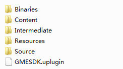
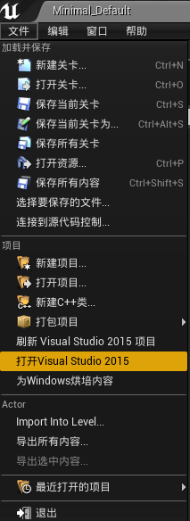
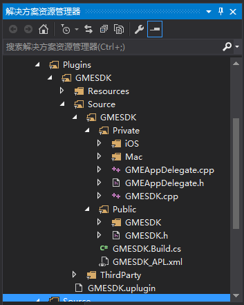
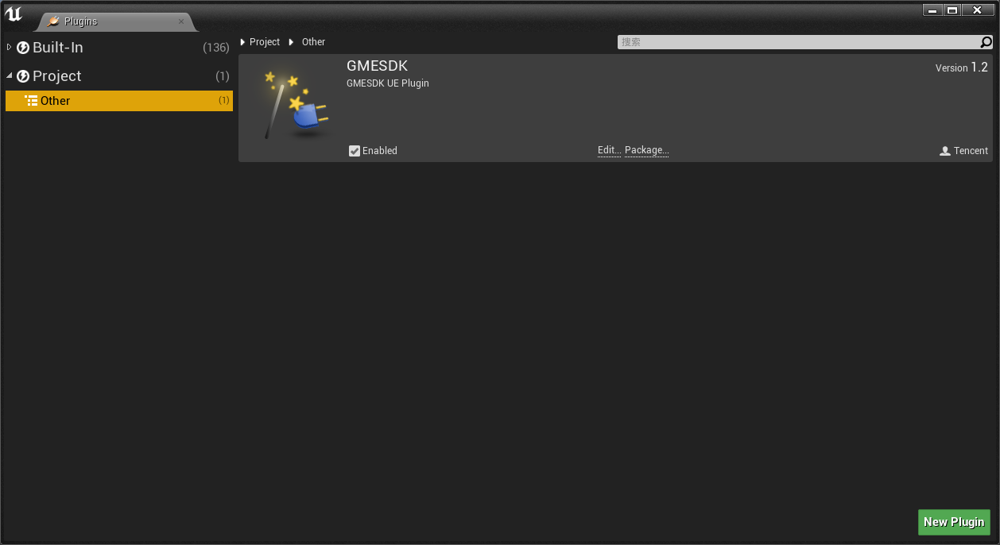

## 简介
欢迎使用腾讯云游戏多媒体引擎 SDK 。为方便 Unreal Engine 开发者调试和接入腾讯云游戏多媒体引擎产品 API，这里向您介绍适用于 Unreal Engine 开发的工程配置。

## SDK 准备
可以联系工作人员获取 SDK。
在 Unreal Engine 工程目录下，打开 Plugins 文件夹（如果没有请自行创建），拷贝 SDK 进去，SDK 目录如下图：



导入之后，在 Unreal Engine 引擎中对插件进行编译。



编译完成后，在VS2015中会出现这样的目录。



重新打开 Unreal Engine 引擎，点击编辑按钮，点击 Plugins 按钮，可以看到 GME 插件。


## Android 预备工作

### 初始化
在AUEDemoLevelScriptActor 的 onLogin 函数中进行初始化。
>实例代码

```
//AUEDemoLevelScriptActor.cpp
void AUEDemoLevelScriptActor::onLogin()
{
    TryInitEnv();
}

static void TryInitEnv()
{
#if PLATFORM_ANDROID
    JNIEnv* JEnv = AndroidJavaEnv::GetJavaEnv();
    if (nullptr != JEnv)
    {
        jclass Class = AndroidJavaEnv::FindJavaClass("com/epicgames/ue4/GameActivity");
        if (nullptr != Class)
        {
            jmethodID getAppPackageNameMethodId = JEnv->GetStaticMethodID(Class, "OnInitGMEJnv", "()Ljava/lang/String;");
            jstring JPackageName = (jstring)JEnv->CallStaticObjectMethod(Class, getAppPackageNameMethodId, nullptr);
            const char * NativePackageNameString = JEnv->GetStringUTFChars(JPackageName, 0);
            FString PackageName = FString(NativePackageNameString);
            JEnv->ReleaseStringUTFChars(JPackageName, NativePackageNameString);
            JEnv->DeleteLocalRef(JPackageName);
            JEnv->DeleteLocalRef(Class);
        }
    }
#endif
}
```