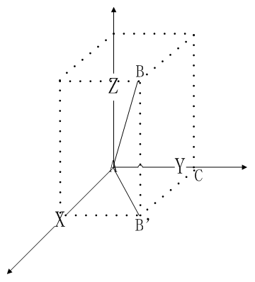
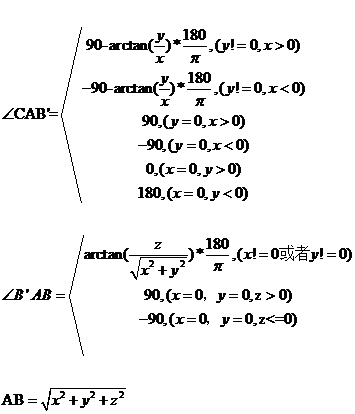

## Introduction
In order to help C + + developers to debug and use Tencent Cloud Real-Time Games Audio and Video Products API,we are now introducing this document to you.


## SDK Initialization  
### 1.Get a singleton
GMESDK is provided as a singleton. All calls start with the ITMGContext and are passed back to the application via the ITMGDelegate callback. This must be set first.

> The Function Prototype  

```
ITMGContext virtual void TMGDelegate(ITMGDelegate* delegate)
```

> Example  

```
ITMGContext* m_pTmgContext;
m_pTmgContext = ITMGContextGetInstance();
```

### 2.Notifications
The GME notifications is passed to the application through ITMGDelegate. The message type refers to ITMG_MAIN_EVENT_TYPE, and the data is json string types on Windows platform. For the key-value, refer to the documentation.

> The Function Prototype 

```
 ITMGDelegate virtual void OnEvent(ITMG_MAIN_EVENT_TYPE eventType,const char* data)
```
> Example 
```
class Callback : public ITMGDelegate 
{
	virtual void OnEvent(ITMG_MAIN_EVENT_TYPE eventType,const char* data)
	{
  		switch(eventType)
  		{
   			//Judge the Notifications and processing
  		}
 	}
}
Callback*  p = new Callback ();
m_pTmgContext->TMGDelegate(p);
```


>Notifications list：

|Notifications      | DESCRIPTION   
| ------------- |:-------------:|
| ITMG_MAIN_EVENT_TYPE_ENTER_ROOM    |Enter the  room
| ITMG_MAIN_EVENT_TYPE_EXIT_ROOM    |Exit the  room
| ITMG_MAIN_EVENT_TYPE_ROOM_DISCONNECT    |The room is disconnected due to network and other reasons
| ITMG_MAIN_EVENT_TYPE_ENABLE_MIC    |Enable microphone 
| ITMG_MAIN_EVENT_TYPE_DISABLE_MIC    |Disable microphone 
|ITMG_MAIN_EVENT_TYPE_ENABLE_SPEAKER|Enable speaker 
|ITMG_MAIN_EVENT_TYPE_DISABLE_SPEAKER|Disable speaker 
|ITMG_MAIN_EVENT_TYPE_CHANGE_ROLE|Change the role
|ITMG_MAIN_EVNET_TYPE_USER_UPDATE|Room members updated

>Data list:

|Type     | Data         |Example|
| ------------- |:-------------:|------------- |
| ITMG_MAIN_EVENT_TYPE_ENTER_ROOM    |result; error_info|{"error_info":"","result":0}
| ITMG_MAIN_EVENT_TYPE_EXIT_ROOM    |result; error_info  |{"error_info":"","result":0}
| ITMG_MAIN_EVENT_TYPE_ROOM_DISCONNECT    |result; error_info  |{"error_info":"waiting timeout, please check your network","result":0}
| ITMG_MAIN_EVENT_TYPE_ENABLE_MIC    |result; error_info  |{"error_info":"","result":0}
| ITMG_MAIN_EVENT_TYPE_DISABLE_MIC    |result; error_info  |{"error_info":"","result":0}
| ITMG_MAIN_EVENT_TYPE_ENABLE_SPEAKER    |result; error_info  |{"error_info":"","result":0}
| ITMG_MAIN_EVENT_TYPE_DISABLE_SPEAKER    |result; error_info  |{"error_info":"","result":0}
| ITMG_MAIN_EVENT_TYPE_SPEAKER_NEW_DEVICE    |result; error_info  |{"deviceID":"{0.0.0.00000000}.{a4f1e8be-49fa-43e2-b8cf-dd00542b47ae}","deviceName":"Speaker (Realtek High Definition Audio)","error_info":"","isNewDevice":true,"isUsedDevice":false,"result":0}
| ITMG_MAIN_EVENT_TYPE_SPEAKER_LOST_DEVICE    |result; error_info  |{"deviceID":"{0.0.0.00000000}.{a4f1e8be-49fa-43e2-b8cf-dd00542b47ae}","deviceName":"Speaker (Realtek High Definition Audio)","error_info":"","isNewDevice":false,"isUsedDevice":false,"result":0}
| ITMG_MAIN_EVENT_TYPE_MIC_NEW_DEVICE    |result; error_info  |{"deviceID":"{0.0.1.00000000}.{5fdf1a5b-f42d-4ab2-890a-7e454093f229}","deviceName":"Mic (Realtek High Definition Audio)","error_info":"","isNewDevice":true,"isUsedDevice":true,"result":0}
| ITMG_MAIN_EVENT_TYPE_MIC_LOST_DEVICE    |result; error_info  |{"deviceID":"{0.0.1.00000000}.{5fdf1a5b-f42d-4ab2-890a-7e454093f229}","deviceName":"Mic (Realtek High Definition Audio)","error_info":"","isNewDevice":false,"isUsedDevice":true,"result":0}
| ITMG_MAIN_EVNET_TYPE_USER_UPDATE    |user_list;  event_id|{"event_id":1,"user_list":["0"]}


## Real-time voice 
### 1.Set the relevant information
Get relevant information, by the Tencent cloud console to apply，you can read more about relevant information in Tencent Cloud.
>In the EnterRoom function call before calling SetAppInfo function and SetAppVersion function to set the relevant information

This function needs SdkAppId number and accountType number from Tencent Cloud Console as a property, plus Id, this Id is uniquely identify a user, the rules developed by the App developers, App can not repeat.
> The Function Prototype  
```
ITMGContext virtual void SetAppInfo(const char* sdkAppId,const char* accountType, const char* openId)
```
|PROPERTY          | TYPES                  |DESCRIPTION |
| ------------- |:-------------:|-------------
| sdkAppId    |char  |SdkAppId number from Tencent Cloud Console|
| accountType    |char  |AccountType number from Tencent Cloud Console|
| openID    |char  |OpenID is Int32 type and must be more than 10000|
> Example  
```
ITMGContext* m_pTmgContext;
m_pTmgContext->SetAppInfo(strAppid, strAccountType, strUserID);
```

Set the version information, which is used to check Log information and Bug, to facilitate background statistics, policy adjustment, etc. (do not set does not affect the function).
> The Function Prototype 
```
ITMGContext virtual void SetAppVersion(const char* appVersion)
```
|PROPERTY          | TYPES                  |DESCRIPTION|
| ------------- |:-------------:|-------------
| appVersion    |char  |version|
> Example  
```
ITMGContext* m_pTmgContext;
m_pTmgContext->SetAppVersion("Test_demo_1.0");
```
Get the SDK version number.
> The Function Prototype 
```
ITMGContext virtual const char* GetSDKVersion()
```
> Example
```
ITMGContext* m_pTmgContext;
m_pTmgContext->GetSDKVersion;
```

Set the Log level.
> The Function Prototype 
```
ITMGContext virtual void SetLogLevel(ITMG_LOG_LEVEL logLevel)
```
|PROPERTY          | TYPES                  |DESCRIPTION|
| ------------- |:-------------:|-------------
| logLevel    |ITMG_LOG_LEVEL  |Print the level of Log|
> Example
```
ITMGContext* m_pTmgContext;
m_pTmgContext->SetLogLevel(level);
```

Set the folder path of the Log.
> The Function Prototype 
```
ITMGContext virtual void SetLogPath(const char* logDir)
```
|PROPERTY          | TYPES                  |DESCRIPTION|
| ------------- |:-------------:|-------------
| logDir    |char  |Folder path|
> Example
```
ITMGContext* m_pTmgContext;
m_pTmgContext->SetLogPath(path);
```

Next is to generate AuthBuffer for encryption and authentication of the relevant functions.Relevant property for details and see Tencent Cloud。  
  
### 2.Enter the room
With the generated reference enter the room, you will receive a notification call ITMG_MAIN_EVENT_TYPE_ENTER_ROOM callback.
>Attention:1、Enter the room by default do not open the microphone and speaker. 
>2、In the EnterRoom function call before calling SetAppInfo function and SetAppVersion function to set the relevant information.

The role of setting is introduced in Tencent Cloud.
> The Function Prototype
```
ITMGContext virtual void EnterRoom(int relationId, const char* role, const char* authBuff,int buffLen)
```
|PROPERTY          | TYPES                  |DESCRIPTION|
| ------------- |:-------------:|-------------
| relationId|int    |Room number, greater than or equal to six whole number|
| role    |char    |Role name, set according to needs, you can also ask access to technical staff to obtain|
| authBuffer    |char    |authentication code|
| buffLen    |int    |The length of the authentication code|
>  Example  
```
m_pTmgContext->EnterRoom(nRoomID, strUserRole, strAuthBuffer, nLength);
```

### 3.Callback to enter the room event
Send message ITMG_MAIN_EVENT_TYPE_ENTER_ROOM when you finish entering the room，use OnEvent function to decidethe event message.
> Example 
```
class Callback : public ITMGDelegate 
{
 	virtual void OnEvent(ITMG_MAIN_EVENT_TYPE eventType,const char* data)
 	{
 	    switch(eventType)
	    {
		case ITMG_MAIN_EVENT_TYPE_ENTER_ROOM:
		{
		    //Callback to enter the room event
		    break;
	        }
		...
            }
        }
}
```

### 4.Check state
This function is used to check state return value is BOOL type.
> The Function Prototype   
```
ITMGContext virtual bool IsRoomEntered()
```
> Example  
```
m_pTmgContext->IsRoomEntered();
```

### 5.Exit room
This function is used to exit the room.
> The Function Prototype   
```
ITMGContext virtual void ExitRoom()
```
> Example      
```
m_pTmgContext->ExitRoom();
```

### 6.Exit the room callback
Through this call back, sdk notifies the app that exit is successful,the event is ITMG_MAIN_EVENT_TYPE_EXIT_ROOM。
> The Function Prototype  
```
class Callback : public ITMGDelegate 
{
 	virtual void OnEvent(ITMG_MAIN_EVENT_TYPE eventType,const char* data)
 	{
 	    switch(eventType)
	    {
		case ITMG_MAIN_EVENT_TYPE_ENTER_ROOM:
		{
		    //Callback to enter the room event
		    break;
	        }
		...
		case ITMG_MAIN_EVENT_TYPE_EXIT_ROOM:
		{
		    //Exit the room callback
		    break;
	        }
            }
        }
}
```


### 7.Room member state changes
The event is not notified until a change of state.For real-time access to the member state, cached after receiving the upper notification, the event message is ITMG_MAIN_EVNET_TYPE_USER_UPDATE,which contains two messages,event_id and endpoints,use OnEvent function to decide the event message.

|event_id     | DESCRIPTION         |Maintain the content|
| ------------- |:-------------:|-------------|
| ITMG_EVENT_ID_USER_ENTER    |A member enters the room|Maintain the list of members|
| ITMG_EVENT_ID_USER_EXIT    |A member exited the room|Maintain the list of members|
| ITMG_EVENT_ID_USER_HAS_AUDIO    |Someone turned on the microphone|Maintain the list of call members|
| ITMG_EVENT_ID_USER_NO_AUDIO    |Someone turned off the microphone|Maintain the list of call members|
> Example   
```
class Callback : public ITMGDelegate 
{
 	virtual void OnEvent(ITMG_MAIN_EVENT_TYPE eventType,const char* data)
 	{
 	    switch(eventType)
	    {
		case ITMG_MAIN_EVENT_TYPE_ENTER_ROOM:
		...
		case ITMG_MAIN_EVNET_TYPE_USER_UPDATE:
		//Room member state changes
		{
		    //Developers parse Json type parameters,get the notifiers  event_id and user_list.
		    switch (eventID)
 		    {
 		    case ITMG_EVENT_ID_USER_ENTER:
  			    //A member enters the room
  			    break;
 		    case ITMG_EVENT_ID_USER_EXIT:
  			    //A member exited the room
			    break;
		    case ITMG_EVENT_ID_USER_HAS_AUDIO:
			    //Someone turned on the microphone
			    break;
		    case ITMG_EVENT_ID_USER_NO_AUDIO:
			    //Someone turned off the microphone
			    break;
		    default:
			    break;
 		    }
		    break;
	        }
        }
    }
}
```


### 8.Get the number of microphone devices
This function is used to get the number of microphone devices.
>Attention:before turning on the microphone。

> The Function Prototype  
```
ITMGAudioCtrl virtual int GetMicListCount(int& nCount)
```
|PROPERTY          | TYPES                  |DESCRIPTION|
| ------------- |:-------------:|-------------
| nCount    |int     |Specify the address of a pass-by object that conveys the number of devices|
> Example      
```
ITMGAudioCtrl* pTmgAudioCtrl = m_pTmgContext->GetAudioCtrl();

pTmgAudioCtrl->GetMicListCount(nCount);
```
### 9.Enumerate the microphone device
This function is used to enumerate the microphone device.Need to get the number of microphone devices.
>Attention:before turning on the microphone。

> The Function Prototype  
```
ITMGAudioCtrl virtual int GetMicList(TMGAudioDeviceInfo* ppDeviceInfoList,  int nCount)
```
|PROPERTY     | TYPES         |DESCRIPTION|
| ------------- |:-------------:|-------------
| ppDeviceInfoList    |TMGAudioDeviceInfo     |Device List|
| nCount    |int     |Get the number of microphone devices|
> Example  
```
ITMGAudioCtrl* pTmgAudioCtrl = m_pTmgContext->GetAudioCtrl();
pTmgAudioCtrl->GetMicList(ppDeviceInfoList,nCount);
```


### 10.Get the number of speaker devices
This function is used to get the number of speaker devices。
>Attention:before turning on the microphone。

> The Function Prototype  
```
ITMGAudioCtrl virtual int GetSpeakerListCount(int& nCount)
```
|PROPERTY     | TYPES         |DESCRIPTION|
| ------------- |:-------------:|-------------
| nCount    |int     |The address of an object that specifies a pass value，pass the number of devices|
> Example   
```
ITMGAudioCtrl* pTmgAudioCtrl = m_pTmgContext->GetAudioCtrl();

pTmgAudioCtrl->GetSpeakerListCount(nCount);
```
### 11.Enumerate speaker devices
This function is used to enumerate the speaker device. Need to get the number of speaker devices.
>Attention:before turning on the microphone。

> The Function Prototype  
```
ITMGAudioCtrl virtual int GetSpeakerList(TMGAudioDeviceInfo* ppDeviceInfoList, int nCount)
```
|PROPERTY     | TYPES         |DESCRIPTION|
| ------------- |:-------------:|-------------
| ppDeviceInfoList    |TMGAudioDeviceInfo     |Device List|
| nCount    |int     |The number of loudspeaker devices acquired|
> Example   
```
ITMGAudioCtrl* pTmgAudioCtrl = m_pTmgContext->GetAudioCtrl();
pTmgAudioCtrl->GetSpeakerList(ppDeviceInfoList,nCount);
```


### 12.Enable or disable microphone
This function is used to enable or disable microphone.
>Attention:The microphone and speaker are set disabled entering the room as default.

> The Function Prototype   
```
ITMGAudioCtrl virtual int EnableMic(bool bEnabled, const char* pMicId)
```
|PROPERTY          | TYPES                  |DESCRIPTION|
| ------------- |:-------------:|-------------
| bEnabled    |bool     |The input property is true if microphone is enabled, and false if microphone is disabled.|
| pMicId    |char     |The microphone's ID,get it from GetMicList API.|
> Example  
```
ITMGAudioCtrl* pTmgAudioCtrl = m_pTmgContext->GetAudioCtrl();

pTmgAudioCtrl->EnableMic(true,pMicId);
pTmgAudioCtrl->EnableMic(false,pMicId);
```

### 13.Callback for the microphone event
The callback function of the microphone event calls the function OnEvent. The SDK successfully calls the microphone through this callback notification message. The event messages are ITMG_MAIN_EVENT_TYPE_ENABLE_MIC,ITMG_MAIN_EVENT_TYPE_DISABLE_MIC,use OnEvent function to decidethe event message.
> Example  
```
class Callback : public ITMGDelegate 
{
 	virtual void OnEvent(ITMG_MAIN_EVENT_TYPE eventType,const char* data)
 	{
 	    switch(eventType)
	    {
		case ITMG_MAIN_EVENT_TYPE_ENTER_ROOM:
		{
		    //Callback to enter the room event
		    break;
	        }
		...
		case ITMG_MAIN_EVENT_TYPE_ENABLE_MIC:
		{
		    //Callback for the microphone event
		    break;
	        }
		case ITMG_MAIN_EVENT_TYPE_DISABLE_MIC:
		{
		    //Callback for the microphone event
		    break;
	        }
            }
        }
}
```
### 14.Get the state of microphone
This function is used to get the state of the microphone.
> The Function Prototype   
```
ITMGAudioCtrl virtual int GetMicState()
```
> Example      
```
ITMGAudioCtrl* pTmgAudioCtrl = m_pTmgContext->GetAudioCtrl();
pTmgAudioCtrl->GetMicState();
```

### 15.Get the energy value of microphone.
Get the energy value of the selected microphone(For example,you can use the energy value for drawing an audio column diagram).
>The Function Prototype   
```
ITMGAudioCtrl virtual int GetMicLevel()
```
> Example  
```
ITMGAudioCtrl* pTmgAudioCtrl = m_pTmgContext->GetAudioCtrl();
pTmgAudioCtrl->GetMicLevel();
```

### 16.Set the volume of microphone
This function is used to set the volume of microphone.Property‘volume’ is used to set the software volume of microphone, it is muted when ‘volume ’ is 0, and default is 100.
> The Function Prototype 
```
ITMGAudioCtrl virtual void SetMicVolume(int volume)
```
|PROPERTY          | TYPES                  |DESCRIPTION|
| ------------- |:-------------:|-------------
| volume    |int      |Set the volume, from 0 to 100|
> Example   
```
ITMGAudioCtrl* pTmgAudioCtrl = m_pTmgContext->GetAudioCtrl();
pTmgAudioCtrl->SetMicVolume(volume);
```

### 17.Get the volume of microphone
This function is used to get the volume of microphone. Return a value of int.
> The Function Prototype   
```
ITMGAudioCtrl virtual int GetMicVolume()
```
> Example  
```
ITMGAudioCtrl* pTmgAudioCtrl = m_pTmgContext->GetAudioCtrl();
pTmgAudioCtrl->GetMicVolume();
```

### 18.Enable or disable speaker
This function is used to enable or disable speaker.
> The Function Prototype   
```
ITMGAudioCtrl virtual int EnableSpeaker(bool bEnabled, const char* pSpeakerID)
```
|PROPERTY          | TYPES                  |DESCRIPTION|
| ------------- |:-------------:|-------------
| bEnabled    |bool       |The input property is true if speaker is enabled, and false if speaker is disabled.|
| pSpeakerID    |char      | The speaker's ID,get it from GetSpeakerList function.|
> Example  
```
ITMGAudioCtrl* pTmgAudioCtrl = m_pTmgContext->GetAudioCtrl();

pTmgAudioCtrl->EnableSpeaker(true,pSpeakerID);
pTmgAudioCtrl->EnableSpeaker(false,pSpeakerID);
```

### 19.Callback for speaker event
The speaker event callback, SDK successfully calls the speaker through this callback notification, the event message is ITMG_MAIN_EVENT_TYPE_ENABLE_SPEAKER, ITMG_MAIN_EVENT_TYPE_DISABLE_SPEAKER.
> Example
```
class Callback : public ITMGDelegate 
{
 	virtual void OnEvent(ITMG_MAIN_EVENT_TYPE eventType,const char* data)
 	{
 	    switch(eventType)
	    {
		case ITMG_MAIN_EVENT_TYPE_ENTER_ROOM:
		{
		    //Callback to enter the room event
		    break;
	        }
		...
		case ITMG_MAIN_EVENT_TYPE_ENABLE_SPEAKER:
		{
		    //Callback for speaker event
		    break;
	        }
		case ITMG_MAIN_EVENT_TYPE_DISABLE_SPEAKER:
		{
		    //Callback for speaker event
		    break;
	        }
            }
        }
}
```

### 20.Obtain the state of the speaker
This function is used to obtain the state of speaker. The type of the return value is integer.
> The Function Prototype   
```
ITMGAudioCtrl virtual int GetSpeakerState()
```

> Example
```
ITMGAudioCtrl* pTmgAudioCtrl = m_pTmgContext->GetAudioCtrl();
pTmgAudioCtrl->GetSpeakerState();
```

### 21.Get the energy value of the selected speaker
This function is used to get the energy value of the selected speaker(For example,you can use the energy value for drawing an audio column diagram).
> The Function Prototype   
```
ITMGAudioCtrl virtual int GetSpeakerLevel()
```

> Example   
```
ITMGAudioCtrl* pTmgAudioCtrl = m_pTmgContext->GetAudioCtrl();
pTmgAudioCtrl->GetSpeakerLevel();
```

### 22.Set the software volume of speaker
This function is used to set the software volume of speaker.
>Attention：Property ‘volume’ is used to set the software volume of speaker, it is muted when ‘volume ’ is 0, and default is 100.

> The Function Prototype   
```
ITMGAudioCtrl virtual void SetSpeakerVolume(int vol)
```
|PROPERTY          | TYPES                  |DESCRIPTION|
| ------------- |:-------------:|-------------
| vol    |int        |Set the volume, from 0 to 100|
> Example   
```
ITMGAudioCtrl* pTmgAudioCtrl = m_pTmgContext->GetAudioCtrl();
pTmgAudioCtrl->SetSpeakerVolume(vol);
```

### 23.Obtain the software volume of speaker
This function is used to obtain the software volume of speaker. The type of the return value is integer, which stands for the volume of the software.
>Attention：We use ‘Level’ to denote the dynamic volume, ‘Volume’is denoted as the software volume of speaker, the final volume is Level*Volume%. Example: ‘Level’ is 100 and ‘Volume’ is 60, so the final volume would be 60.

>The Function Prototype  
```
ITMGAudioCtrl virtual int GetSpeakerVolume()
```
> Example
```
ITMGAudioCtrl* pTmgAudioCtrl = m_pTmgContext->GetAudioCtrl();

pTmgAudioCtrl->GetSpeakerVolume();
```
### 24. Enable or disable ear back(listen self's voice)
The function is used to enable or disable ear back(listen self's voice).
> The Function Prototype  
``` 
ITMGAudioCtrl virtual int EnableLoopBack(bool bEnabled)
```
|PROPERTY     | TYPES         |DESCRIPTION|
| ------------- |:-------------:|-------------
| bEnabled    |bool         |enable or disable |
> Example   
```
ITMGAudioCtrl* pTmgAudioCtrl = m_pTmgContext->GetAudioCtrl();
pTmgAudioCtrl->EnableLoopBack(true);
pTmgAudioCtrl->EnableLoopBack(false);
```


### 25.Obtain quality information
To obtain the information of the quality of alive. The function is used to check the quality of conversation and eliminate problems.
> The Function Prototype  
```
ITMGRoom virtual const char* GetQualityTips()
```

> Example 
```
m_pTmgContext.GetRoom().GetQualityTips();
```


## Spatial audio access
### 1.Enable or disable the spatial audio
This function is used to enable or disable the spatial audio.
> The Function Prototype  
```
ITMGAudioCtrl virtual int EnableSpatializer(bool bEnabled)
```
|PROPERTY          | TYPES                  |DESCRIPTION|
| ------------- |:-------------:|-------------
| bEnabled    |bool         |Enable or disable the spatial audio|
> Example   
```
ITMGAudioCtrl* pTmgAudioCtrl = m_pTmgContext->GetAudioCtrl();

pTmgAudioCtrl->EnableSpatializer(true);
pTmgAudioCtrl->EnableSpatializer(false);
```


### 2.Get the current spatial audio state
This function is used to get the current spatial audio state.
> The Function Prototype    
```
ITMGAudioCtrl virtual bool IsEnableSpatializer()
```
> Example
```
ITMGAudioCtrl* pTmgAudioCtrl = m_pTmgContext->GetAudioCtrl();

pTmgAudioCtrl->IsEnableSpatializer();
```


### 3.Update sound source orientation
This function is used to update sound source orientation.
> The Function Prototype  
```
ITMGAudioCtrl virtual int UpdateSpatializer(std::string& identifier,float azimuth,float elevation,float distance_cm)
```
|PROPERTY          | TYPES                  |DESCRIPTION|
| ------------- |:-------------:|-------------
| identifier    |string         |OpenID is Int32 type and must be more than 10000|
| azimuth    |float         |position|
| elevation    |float         |angle|
| distance_cm    |float         |distance，centimeter is the distance unit|

>Function principle



Reference pictures get the property,assuming that the receiving end user is point A, the sending end user is point B,<a href="https://www.codecogs.com/eqnedit.php?latex=\angle&space;CAB'" target="_blank"></a> is azimuth，<a href="https://www.codecogs.com/eqnedit.php?latex=\angle&space;B'AB" target="_blank"></a> is elevation，AB is distance_cm .
Suppose the coordinates <a href="https://www.codecogs.com/eqnedit.php?latex=A\left&space;(&space;x_{1},&space;y_{1},&space;z_{1}&space;\right&space;)" target="_blank"></a> ，<a href="https://www.codecogs.com/eqnedit.php?latex=B\left&space;(&space;x_{2},&space;y_{2},&space;z_{2}&space;\right&space;)" target="_blank"></a>,converted to<a href="https://www.codecogs.com/eqnedit.php?latex=A\left&space;(&space;0,&space;0,0&space;\right&space;)" target="_blank"></a>，<a href="https://www.codecogs.com/eqnedit.php?latex=B\left&space;(&space;x,&space;y,z\right&space;)" target="_blank"></a>,and <a href="https://www.codecogs.com/eqnedit.php?latex=x=x_{2}-x_{1},y=y_{2}-y_{1},z=z_{2}-z_{1}" target="_blank"></a>
The formula is:



> Example
```
ITMGAudioCtrl* pTmgAudioCtrl = m_pTmgContext->GetAudioCtrl();
pTmgAudioCtrl->UpdateSpatializer(identifier,azimuth,elevation,distance_cm);
```

>Function appendix
```
/*     ^
      z|   y(azi=0)
       |  /
       | /
	   .----->x(azi=90)    ...w = 90-azi
*/
#define QDSP_PAI  3.1415926535897

void xyz2dae(float *dist,float *azi,float *elve,float x,float y,float z)
{
	float paitodu = 180/QDSP_PAI;
	float sqxy = sqrt(x*x+y*y);

	*dist = sqrt(x*x + y*y + z*z);

	if (x)
	{
		if (y)
		{
			if (x>0)
			{
				*azi = 90 - atan(y/x)*paitodu;
			} 
			else
			{
				*azi = -90 - atan(y/x)*paitodu;
			}

		} 
		else
		{
			if (x>0)
			{
				*azi = 90;
			} 
			else
			{
				*azi = -90;
			}
		}

	} 
	else
	{
		if (y>0)
		{
			*azi = 0;
		} 
		else
		{
			*azi = 180;
		}
	}

	if (sqxy)
	{
		*elve = atan(z/sqxy)*paitodu;
	}
	else
	{
		if (z>0)
		{
			*elve = 90;
		} 
		else
		{
			*elve = -90;
		}
		
	}
}


void dae2xyz(float *x,float *y,float *z,float dist,float azi,float elve)
{
	float sqxy;
	float dutopai = QDSP_PAI/180;
	
	*z = dist*sin(elve*dutopai);
	sqxy = dist*cos(elve*dutopai);
	*x = sqxy*cos((90-azi)*dutopai);
	*y = sqxy*sin((90-azi)*dutopai);
}
```