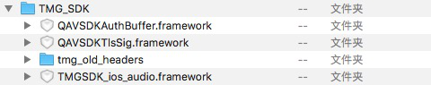
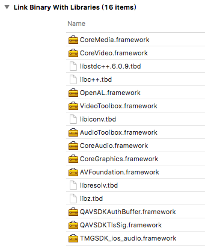

## 简介
欢迎使用腾讯云游戏多媒体引擎 SDK 。为方便 iOS 开发者调试和接入腾讯云游戏多媒体引擎产品 API，这里向您介绍适用于 iOS 开发的工程配置。

## SDK 准备
可以通过以下方式获取 SDK。

### 1. 打开腾讯云为您提供的[游戏多媒体引擎](https://cloud.tencent.com/product/tmg?idx=1)  

### 2. 在界面中找到开发者资源一栏，找到 iOS 版本的 SDK 资源。

### 3. 点击【下载】按钮。
下载完的SDK资源解压后有以下几个部分：

## 系统要求
SDK 支持在 iOS7.0 及以上系统上运行。

## 预备工作

### 1. 导入 SDK 文件  
需要根据情况在 Xcode 的 Link Binary With Libraries 里面加上下面的依赖库，并设置 Framework Search Paths 指向 SDK 所在目录，如图所示：  

GME 里面有三个 Framework，如下：
>TMG.framework：

音视频的 SDK，必选。
>QAVSDKAuthBuffer.framework：

用来生成语音房间权限加密串的 SDK，正式部署的时候可以部署在后台，则不需要这个 SDK。
>QAVSDKTlsSig.framework：

用来生成 PTT（离线语音） 加密验证串的 SDK，如果没有使用 PTT（离线语音） 可以不设置。

### 2. 添加依赖库  
参考下图：  

  
### 3. 关闭 bitcode 
Bitcode 需要工程依赖的所有类库同时支持，SDK 暂时还不支持 Bitcode，可以先临时关闭。
关闭此设置，只需在 Targets - Build Settings 中搜索 Bitcode 即可，找到相应选项，设置为 NO。
如下图：  

