## 简介

欢迎使用[腾讯云游戏多媒体引擎 SDK](https://cloud.tencent.com/product/tmg?idx=1) 。为方便开发者接入腾讯云游戏多媒体引擎产品，这里向您介绍适用于游戏多媒体引擎 SDK 的接入指引。

使用GME 有以下五个步骤：
[1、在腾讯云后台新建 GME 服务](https://github.com/TencentMediaLab/GME/blob/master/GME%20Introduction.md#%E6%96%B0%E5%BB%BA%E6%9C%8D%E5%8A%A1)

2、下载对应版本的客户端SDK

3、参照接入API文档， 将SDK移植到工程

4、查看日常运营后台统计

5、接入过程中特殊问题自主排除与反馈

## 新建服务

### 1.登录成功后，点击【新建应用】

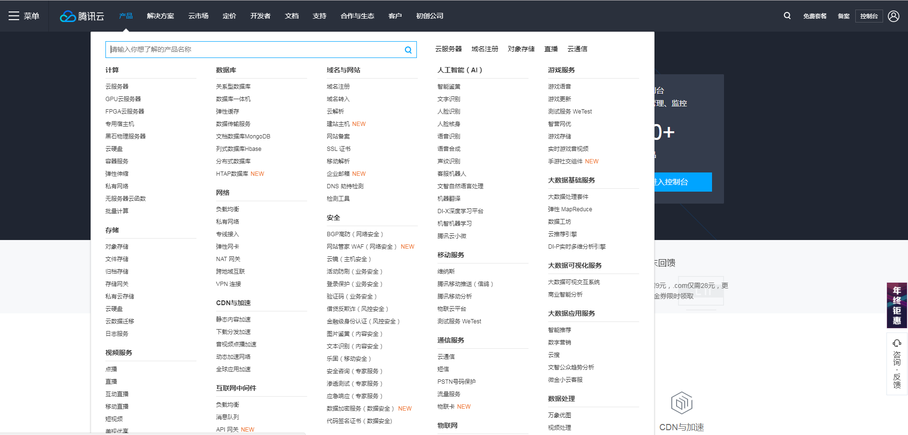

### 2.填入相应的信息。  
填写该页面所需信息，按照需要选择所需的服务。 
> 应用类型的不同会导致设置的选项有所不同，设置完成后不可再修改。应用类型不同也会影响收费，收费请参考[产品价格](https://cloud.tencent.com/product/tmg?idx=1#price)及咨询相关腾讯云商务工作人员。
> 游戏类应用需选择相应的游戏类型及平台引擎。根据技术人员提供的方案选择相应的采样率。

#### 新建游戏类应用参考图：

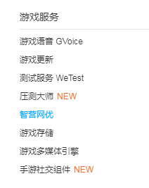

#### 新建社交主播类应用参考图：

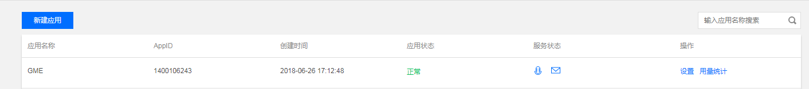

### 3.创建应用成功后，应用管理列表就有刚刚创建的应用。
- 列表中的 AppID 在接入 SDK 进行开发过程中会作为参数使用。

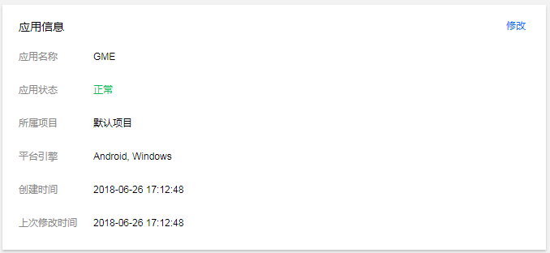

### 4.应用管理列表中，在相应的应用那一行，点击【设置】按钮，进入应用设置。

#### 游戏类应用设置参考图：

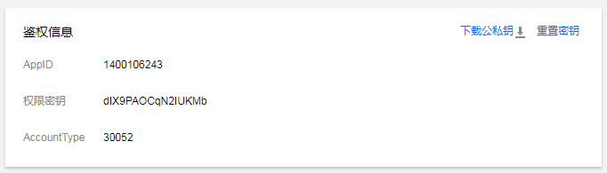

#### 社交主播类应用设置参考图：
> 主播社交类应用无【服务配置】模块。

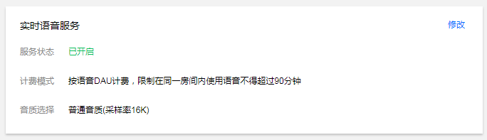

### 5.应用信息模块，点击【修改】后页面如图。应用名称及项目可修改，应用类型不可修改。

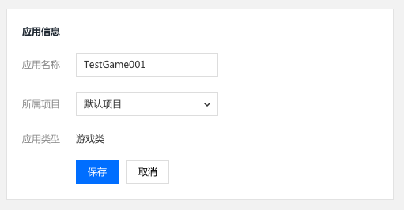

### 6.鉴权信息模块
- 此模块中的权限密钥会作为参数使用到 SDK 接入过程中。 
- 只有创建游戏的账号、主账号、全局协作者可以操作【重置秘钥】。
- 页面修改密钥后，15 分钟 ~ 1 小时内生效，不建议频繁更换。
- 点击【下载公私钥】可以下载此应用离线语音相应的公私钥。
#### 鉴权详细使用请参考游戏多媒体引擎密钥说明文档。

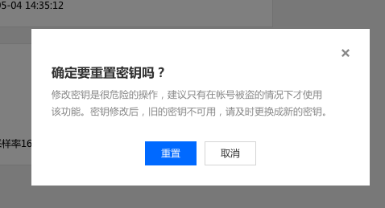

### 7.服务配置模块
- 此模块只适用于游戏类应用
在这里可以对服务配置进行更改。

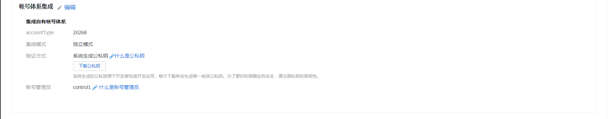

## 下载 SDK 
### 1.下载地址
请在[腾讯云游戏多媒体引擎官网](https://cloud.tencent.com/product/tmg?idx=1)下载相关 Demo 及 SDK。

### 2.接入准备
接入 SDK 需要使用腾讯云提供的 appid 及相关权限密钥。即应用管理列表中的 AppID 及 应用设置中的鉴权信息模块。
- 接入实时语音时候会使用鉴权信息模块中的权限密钥。
- 接入离线语音时候会使用鉴权信息模块中的下载的公私钥。

更多平台相关配置请参考各平台工程配置文档。

### 3.官方 Demo 使用需知
Demo 中带有腾讯云测试账号，可进行功能体验，如需更换个人及公司测试账号，需要在 Demo 中在相应界面将腾讯云测试账号 AppID 更换为开发者在控制台获取的 AppID，并需要在 AVChatViewController-GetAuthBuffer 函数中修改实时语音的权限密钥。

## 相关 SDK 技术文档
#### Unity 引擎
- ##### *支持平台:Android, iOS*
- [Unity 工程配置文档](https://github.com/TencentMediaLab/GME/blob/master/GME%20Developer%20Manual/Unity%20Developer%20Manual/Unity%20SDK%20Project%20Configuration.md)

- [Unity 开发接入技术文档](https://github.com/TencentMediaLab/GME/blob/master/GME%20Developer%20Manual/Unity%20Developer%20Manual/Unity%20SDK%20Developer%20Manual.md)

#### Unreal Engine 引擎
- ##### *支持平台:Android, iOS, Windows, MAC*
- [Unreal Engine 工程配置文档](https://github.com/TencentMediaLab/GME/blob/master/GME%20Developer%20Manual/Unreal%20Engine%20Developer%20Manual/Unreal%20Engine%20SDK%20Project%20Configuration.md)

- [Unreal Engine 开发接入技术文档](https://github.com/TencentMediaLab/GME/blob/master/GME%20Developer%20Manual/Unreal%20Engine%20Developer%20Manual/Unreal%20Engine%20SDK%20Developer%20Manual.md)

#### Cocos2D 引擎
- ##### *支持平台:Android, iOS*
- [Cocos2D-X 工程配置文档](https://github.com/TencentMediaLab/GME/blob/master/GME%20Developer%20Manual/Cocos2D-X%20Developer%20Manual/Cocos2d%20SDK%20Project%20Configuration.md)

- [Cocos2D-X 开发接入技术文档](https://github.com/TencentMediaLab/GME/blob/master/GME%20Developer%20Manual/Cocos2D-X%20Developer%20Manual/Cocos2d%20SDK%20Developer%20Manual.md)

#### 原生应用
- [PC（C++）开发接入技术文档](https://github.com/TencentMediaLab/GME/blob/master/GME%20Developer%20Manual/Windows%20Developer%20Manual/C%2B%2B%20SDK%20Developer%20Manual.md)

- [iOS 工程配置文档](https://github.com/TencentMediaLab/GME/blob/master/GME%20Developer%20Manual/iOS%20Developer%20Manual/iOS%20SDK%20Project%20Configuration.md)

- [iOS 开发接入技术文档](https://github.com/TencentMediaLab/GME/blob/master/GME%20Developer%20Manual/iOS%20Developer%20Manual/iOS%20SDK%20Developer%20Manual.md)

- [Android 工程配置文档](https://github.com/TencentMediaLab/GME/blob/master/GME%20Developer%20Manual/Android%20Developer%20Manual/Android%20SDK%20Project%20Configuration.md)

- [Android 开发接入技术文档](https://github.com/TencentMediaLab/GME/blob/master/GME%20Developer%20Manual/Android%20Developer%20Manual/Android%20SDK%20Developer%20Manual.md)

## 控制台用量统计使用

### 1.在应用管理界面打开用量统计

在所需查询的应用中点击【用量统计】。

### 2.游戏类应用用量统计

用量统计展示游戏类应用DAU数据。
- 【关键数据1】展示该应用昨日的语音 DAU 总数
- 【关键数据2】展示该应用大陆语音 DAU 数
- 【关键数据3】展示该应用海外语音 DAU 数
- 默认显示近 7 天的总量 DAU 数据，支持切换时间、切换地域查看用量数据
- 数据详情中点击【下载】图标则将所选日期内的用量数据下载为 Excel

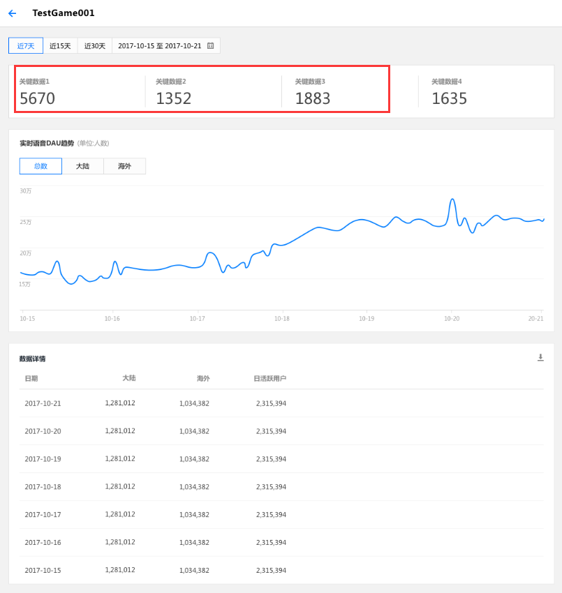

### 3.社交直播类应用用量统计

用量统计展示社交主播类应用 DAU 数据。
- 【关键数据1】展示该应用昨日的语音时长
- 语音时长单位为分钟，这里的交互稿显示错误
- 数据详情中点击【下载】图标则将所选日期内的用量数据下载为 Excel

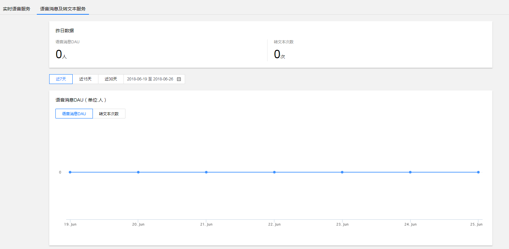

## 特殊问题处理
[腾讯云游戏多媒体引擎FAQ文档](https://github.com/TencentMediaLab/GME/blob/master/GME%20Developer%20Manual/GME%20FAQ%20Manual.md)    
[错误码文档](https://github.com/TencentMediaLab/GME/blob/master/GME%20Developer%20Manual/GME%20Error%20Code.md)
