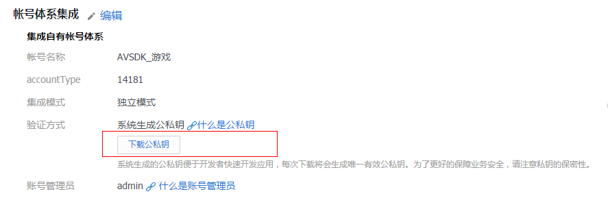
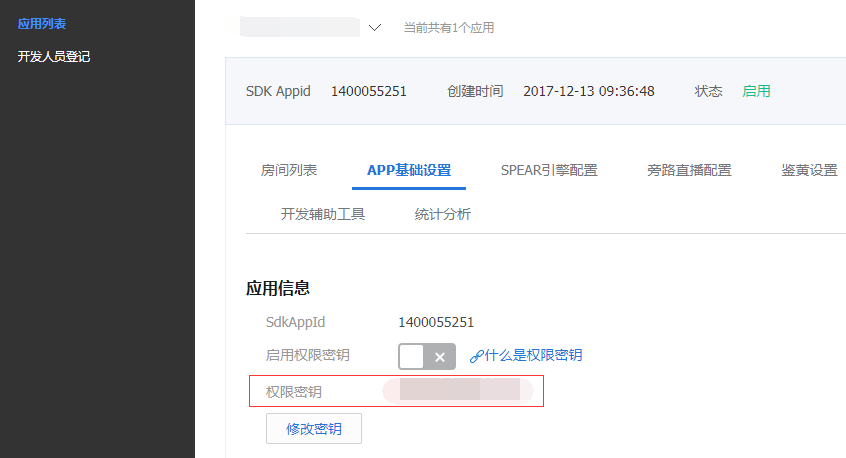

## 简介

欢迎使用[腾讯云游戏多媒体引擎 SDK](https://cloud.tencent.com/product/tmg?idx=1) 。为方便开发者接入腾讯云游戏多媒体引擎产品，这里向您介绍适用于游戏多媒体引擎 SDK 的接入指引（适用于全平台）。

## 开通实时音视频服务
### 1.在[腾讯云官网首页](https://cloud.tencent.com/)的菜单中点击产品。  

### 2.点击视频服务界面下的【游戏多媒体引擎】按钮。  

### 3.点击界面上的【立即使用】按钮

>如果没有登录，请按照需求进行登录并实名验证。

### 4.登录成功后，点击【新建应用】

### 5.填入相应的信息。  
填写该页面所需信息，按照需要选择所需的服务。  

### 6.创建应用成功后，应用列表就有刚刚创建的应用。

### 7.点击【APP基础设置】，点击账号体系集成旁边的【编辑】进行配置。

### 8.选择自己需要的集成模式，添加一个RestApi用户帐号，点击【保存】。
帐号体系集成中会有一个accountType号码，加上此界面应用信息中的SdkAppId号码。

>注意：谨记这两个参数，接口 SetAppInfo 会使用这两个参数。

## TLS签名
概述：离线语音的上传下载依赖[腾讯云的COS平台](https://console.cloud.tencent.com/ilvb?show=2)，需要单独的鉴权。鉴权所用到的签名产生过程涉及到明文、密钥和算法。
### 1.明文
明文为 appid，accountType 和 openid。

### 2.密钥的获取
集成模式请选择“独立模式”。下载的 zip 文件中选择 private_key 作为鉴权算法的加密密钥。  

解压下载的 zip 文件后可以看到两个文件，如下图。  

根据需要用记事本打开相应的文件，复制里面的密钥，作为参数填入相应函数中。
>注意：每次下载获取的公私钥对，必须等待1个小时才能正常使用。

### 3.算法的部署
总体建议，建议接入初期使用客户端部署方案，后面可优化为部署在 App 后台。

|方案       | 坏处        | 详情 |
| ------------- |:-------------:| ------------- 
| 后台部署   		|工作量大				|[TLS后台API使用手册](https://cloud.tencent.com/document/product/269/1510#1-.E6.A6.82.E8.BF.B0)					|
| 客户端部署      	| 安装包体积，安全性 		|工程中额外引入 libqav_tlssig.so（Android） 和 QAVSDKTlsSig.framework（iOS）两个库文件，并额外引入 QAVSig.cs。 	|  

使用详情见各平台文档。

## 音视频密钥
互动直播提供音视频密钥，用于相关功能的加密和鉴权。具体详情见：[音视频密钥使用说明文档](https://cloud.tencent.com/document/product/268/11240)。
鉴权所用到的签名产生过程涉及到明文、密钥和算法。
明文为以下字段的网络序拼接：

### 1.密钥
3.1.[腾讯云控制台获取](https://console.cloud.tencent.com/ilvb?show=2) （启用权限密钥这个CheckBox 是当前页面bug，勾选和不勾选都可以用，可以无视）  

### 2.算法
TEA对称加密算法。
总体建议，建议接入初期使用客户端部署方案，后面可优化为部署在游戏 App 后台。

|方案       		| 坏处        				| 详情 																															|
| ------------- |:-------------:| ------------- 
| 后台部署    		|工作量大				|[音视频密钥使用说明](https://cloud.tencent.com/document/product/268/11240)													|
| 客户端部署      	| 安装包体积大，安全性低	|工程中额外引入libqav_authbuff.so（Android） 和 QAVSDKAuthBuffer.framework（iOS）两个库文件，并额外引入 QAVAuthBuffer.cs。 	|  

使用详情见各平台文档。