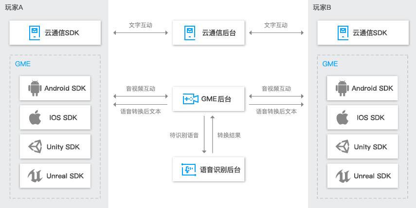

## GME
[腾讯云游戏音视频](https://cloud.tencent.com/product/tmg?idx=1)（Game Multimedia Engine）是一个专门针对游戏场景定制的实时游戏音视频 SDK，覆盖了休闲社交类、MOBA 类、MMORPG 等多种游戏类型，提供了包括多人实时语音、实时视频、语音消息、语音转文本等功能。功能完备，接入门槛低，一个 SDK 即可满足多样化的游戏音视频诉求。

## 产品架构

## 收费标准
|项目       	| 单价        		|
| ------------ |:-----------------:| 
| 纯音频通话	|5.9 元/1000 分钟	|
| 音视频通话	|25 元/1000 分钟	|
| 月功能费	|1000 元/月		|

## SDK更新说明
### GME1.2（2018-03-20）
#### 新增功能
1、支持更多语言接口：
 Native接口封装，更简单易用，与Unity接口更一致
 移动端Cocos引擎接口封装，支持更多类型游戏
2、支持更多平台
 GME接入手Q厘米秀小游戏引擎，开发者可无成本接入音频
 GME落地QGSK，开发者集成音视频能力更便捷
3、新能力开发
 支持调节麦克风音量
 PC端支持小队语音，更好支持吃鸡类游戏
 PC端支持播放伴奏，支持多种格式
 Android端支持播放m4a和mp4文件，伴奏能力更强
#### 优化
 1、优化了狼人杀场景音频前处理效果，多人同时讲话效果更清晰
 2、优化了K歌等场景下的音质表现，支持配置更高音质
 3、优化了Moba场景下语音延迟，小队语音延迟更低
 4、优化杂音消除算法，语音音质更纯净
### GME1.1（2017-10-18）
#### 新增功能
1、狼人杀场景下支持视频；
2、游戏 SDK 支持多种格式的伴奏和音效；
3、新增游戏场景下离线语音及语音转文本能力；
4、支持房间内上麦前视频画面预览；
#### 优化
1、提供进房鉴权的客户端实现模块，降低SDK接入门槛。
2、iOS/Android 端啸叫抑制效果优化；
3、狼人杀场景下音质平稳度、网络抗性等指标优化；
#### 修复
修复了 Android 4.2 及以下系统版本必现 crash 的问题。

## 接入通用文档
#### [接入指引文档](https://github.com/TencentMediaLab/GME/blob/master/GME%20Introduction.md)
#### [角色配置文档](https://github.com/TencentMediaLab/GME/blob/master/GME%20Developer%20Manual/GME%20Role%20Manual.md)
#### [错误码列表](https://github.com/TencentMediaLab/GME/blob/master/GME%20Developer%20Manual/GME%20Error%20Code.md)

## 各平台接入文档
#### PC 平台
[PC（C++）开发接入技术文档](https://github.com/TencentMediaLab/GME/blob/master/GME%20Developer%20Manual/Windows%20Developer%20Manual/C%2B%2B%20SDK%20Developer%20Manual.md)

#### iOS 平台
[iOS 开发接入技术文档](https://github.com/TencentMediaLab/GME/blob/master/GME%20Developer%20Manual/iOS%20Developer%20Manual/iOS%20SDK%20Developer%20Manual.md)

[iOS 工程配置文档](https://github.com/TencentMediaLab/GME/blob/master/GME%20Developer%20Manual/iOS%20Developer%20Manual/iOS%20SDK%20Project%20Configuration.md)

#### Android 平台
[Android 开发接入技术文档](https://github.com/TencentMediaLab/GME/blob/master/GME%20Developer%20Manual/Android%20Developer%20Manual/Android%20SDK%20Developer%20Manual.md)

[Android 工程配置文档](https://github.com/TencentMediaLab/GME/blob/master/GME%20Developer%20Manual/Android%20Developer%20Manual/Android%20SDK%20Project%20Configuration.md)

#### Unity 平台
[Unity 开发接入技术文档](https://github.com/TencentMediaLab/GME/blob/master/GME%20Developer%20Manual/Unity%20Developer%20Manual/Unity%20SDK%20Developer%20Manual.md)

[Unity 工程配置文档](https://github.com/TencentMediaLab/GME/blob/master/GME%20Developer%20Manual/Unity%20Developer%20Manual/Unity%20SDK%20Project%20Configuration.md)

#### Unreal Engine 平台
[Unreal Engine 开发接入技术文档](https://github.com/TencentMediaLab/GME/blob/master/GME%20Developer%20Manual/Unreal%20Engine%20Developer%20Manual/Unreal%20Engine%20SDK%20Developer%20Manual.md)

[Unreal Engine 工程配置文档](https://github.com/TencentMediaLab/GME/blob/master/GME%20Developer%20Manual/Unreal%20Engine%20Developer%20Manual/Unreal%20Engine%20SDK%20Project%20Configuration.md)

#### Cocos2D 平台
[Cocos2D-X 开发接入技术文档](https://github.com/TencentMediaLab/GME/blob/master/GME%20Developer%20Manual/Cocos2D-X%20Developer%20Manual/Cocos2d%20SDK%20Developer%20Manual.md)

[Cocos2D-X 工程配置文档](https://github.com/TencentMediaLab/GME/blob/master/GME%20Developer%20Manual/Cocos2D-X%20Developer%20Manual/Cocos2d%20SDK%20Project%20Configuration.md)

## 联系我们
QQ：1558615124