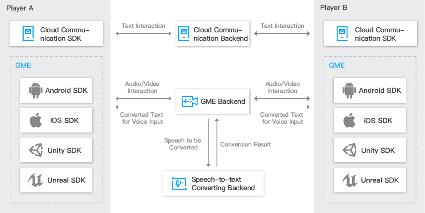

## GME
[Game Multimedia Engine ](https://cloud.tencent.com/product/tmg?idx=1)(GME) is a real-time game audio and video SDK that has been specifically customized for game scenes. It supports many types of games, including casual games MOBA and MMORPG. It also provides real-time multi-person voice chat, real-time video chat, voice messages, speech-to-text conversion, and other features. With a complete set of features and a low access threshold, the demand for diverse mobile gaming scenes is met with just one SDK.

## Product Architecture

##  User Guide
#### [Access Guide](https://github.com/TencentMediaLab/GME/blob/master/GME%20Introduction_intl.md)
#### [Role Description](https://github.com/TencentMediaLab/GME/blob/master/GME%20Developer%20Manual/GME%20Role%20Manual_intl.md)
#### [Error Code](https://github.com/TencentMediaLab/GME/blob/master/GME%20Developer%20Manual/GME%20Error%20Code_intl.md)

##  Development Guide
#### Unity platform
[Unity Engineering Configuration](https://github.com/TencentMediaLab/GME/blob/master/GME%20Developer%20Manual/Unity%20Developer%20Manual/Unity%20SDK%20Project%20Configuration_intl.md)

[Unity API Documentation](https://github.com/TencentMediaLab/GME/blob/master/GME%20Developer%20Manual/Unity%20Developer%20Manual/Unity%20SDK%20Developer%20Manual_intl.md)

#### Unreal Engine platform

[Unreal Engine API Documentation](https://github.com/TencentMediaLab/GME/blob/master/GME%20Developer%20Manual/Unreal%20Engine%20Developer%20Manual/Unreal%20Engine%20SDK%20Developer%20Manual_intl.md)

#### Cocos2D platform
[Cocos2D-X Engineering Configuration](https://github.com/TencentMediaLab/GME/blob/master/GME%20Developer%20Manual/Cocos2D-X%20Developer%20Manual/Cocos2d%20SDK%20Project%20Configuration_intl.md)

[Cocos2D-X API Documentation](https://github.com/TencentMediaLab/GME/blob/master/GME%20Developer%20Manual/Cocos2D-X%20Developer%20Manual/Cocos2d%20SDK%20Developer%20Manual_intl.md)

#### PC platform
[PC（C++）API Documentation](https://github.com/TencentMediaLab/GME/blob/master/GME%20Developer%20Manual/Windows%20Developer%20Manual/C%2B%2B%20SDK%20Developer%20Manual_intl.md)

#### iOS platform
[iOS Engineering Configuration](https://github.com/TencentMediaLab/GME/blob/master/GME%20Developer%20Manual/iOS%20Developer%20Manual/iOS%20SDK%20Project%20Configuration_intl.md)

[iOS API Documentation](https://github.com/TencentMediaLab/GME/blob/master/GME%20Developer%20Manual/iOS%20Developer%20Manual/iOS%20SDK%20Developer%20Manual_intl.md)

#### Android platform
[Android Engineering Configuration](https://github.com/TencentMediaLab/GME/blob/master/GME%20Developer%20Manual/Android%20Developer%20Manual/Android%20SDK%20Project%20Configuration_intl.md)

[Android API Documentation](https://github.com/TencentMediaLab/GME/blob/master/GME%20Developer%20Manual/Android%20Developer%20Manual/Android%20SDK%20Developer%20Manual_intl.md)

## Change History
### GME1.1（2017-10-18）
#### New Features
1、Support video chat in table game scenes.

2、Support backing tracks and sound effects in multiple formats in the GME SDK.

3、Add the push-to-talk and speech-to-text features to game scenes.

4、Support a screen preview for video chat before users join broadcasting in a room.
#### Optimization
1、Provide a client implementation module for room entry authentication to lower the SDK access threshold.

2、Optimize the squealing suppression effects for iOS and Android.

3、Optimize the sound quality stability, anti packet loss rate, and other metrics in table game scenes.
#### Bug Fixes
Fix the system crash in Android 4.2 and earlier versions.

## Contact Us
QQ：1558615124

E-Mail：terryzuo@tencent.com		garyzeng@tencent.com		v_caisxcai@tencent.com

## 文档
[文档目录(中文)](https://github.com/TencentMediaLab/GME/blob/master/README.md)